# 33 — Architecture Diagrams

Mermaid source. Renders in GitHub, GitLab, VS Code, Obsidian and most documentation tooling.

## D1 — System context

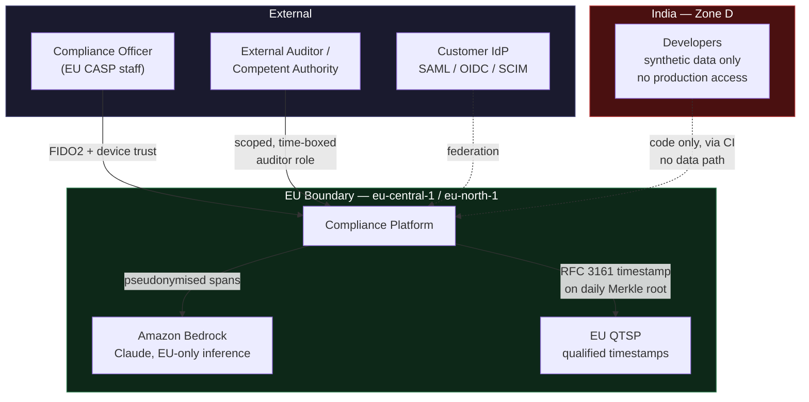

## D2 — Network and account topology

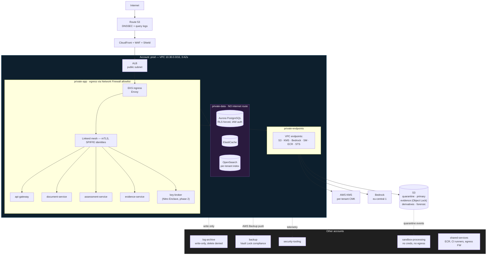

## D3 — Document access path (five enforcement points)

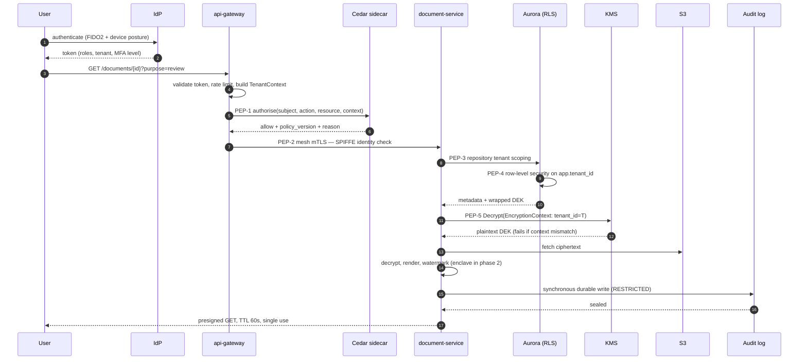

## D4 — Document upload pipeline

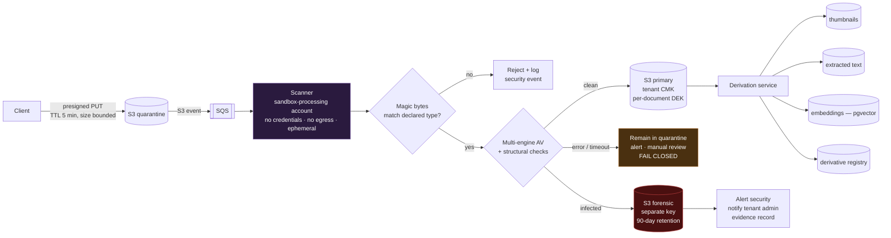

## D5 — AI assessment pipeline

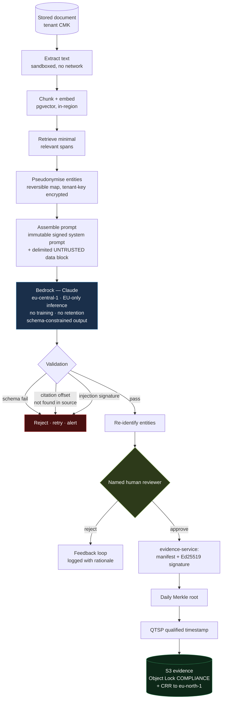

## D6 — Key hierarchy

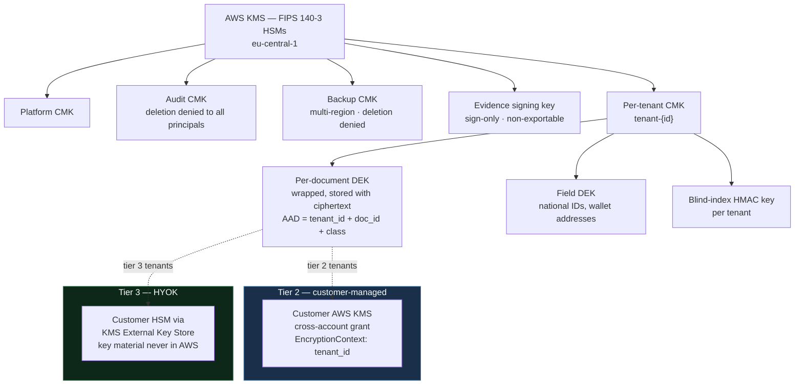

## D7 — Environment zones and the cross-border boundary

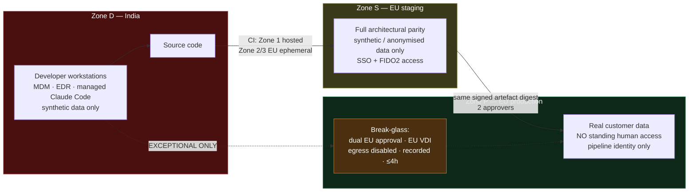

## D8 — CI/CD trust zones

```mermaid
flowchart LR
    subgraph Z1["Zone 1 — UNTRUSTED"]
        PR["Pull request"] --> V1["GitHub-hosted runners<br/>read-only token · NO credentials<br/>lint · test · SAST · SCA · IaC · secrets"]
    end
    subgraph Z2["Zone 2 — TRUSTED BUILD"]
        M["Merge to main<br/>2 reviewers · signed commits"] --> B["Self-hosted ephemeral runner<br/>eu-central-1 · OIDC to ci-build role"]
        B --> ART["Signed image + SBOM<br/>+ SLSA provenance<br/>+ scan attestation → ECR"]
    end
    subgraph Z3["Zone 3 — DEPLOY"]
        ART --> STG2["Argo CD → staging<br/>Kyverno verifies attestations"]
        STG2 --> APR{"2 approvers"}
        APR --> CAN["Canary 5% → 25% → 100%<br/>auto-rollback on SLO breach"]
        CAN --> EVD2["Deployment evidence record"]
    end
    V1 -.->|"never runs in Zone 2/3"| Z2

    style Z1 fill:#4a1010,stroke:#c04040,color:#fff
    style Z2 fill:#3a3a1a,stroke:#a0a040,color:#fff
    style Z3 fill:#0d2818,stroke:#2e7d4f,color:#fff
```

## D9 — Evidence integrity chain

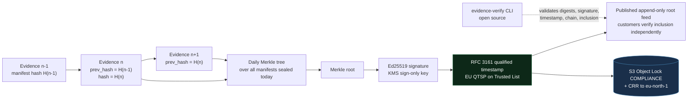

## D10 — Disaster recovery topology

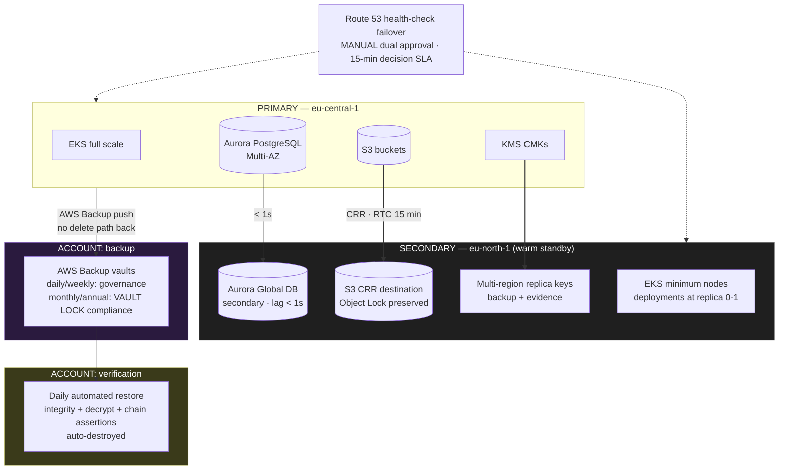

## D11 — Data classification and lifecycle

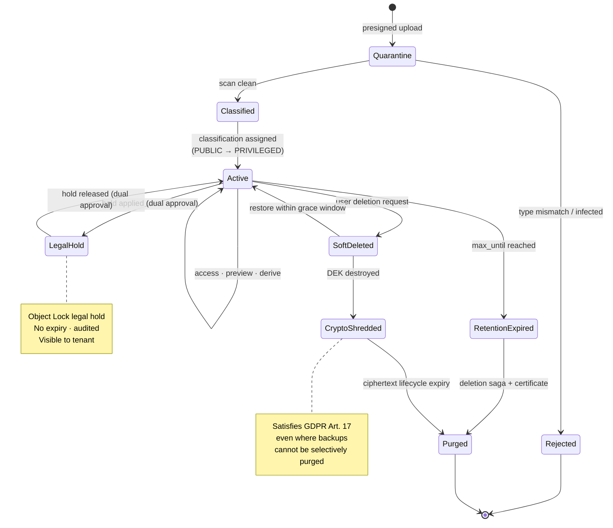

## D12 — Incident response and regulatory clocks

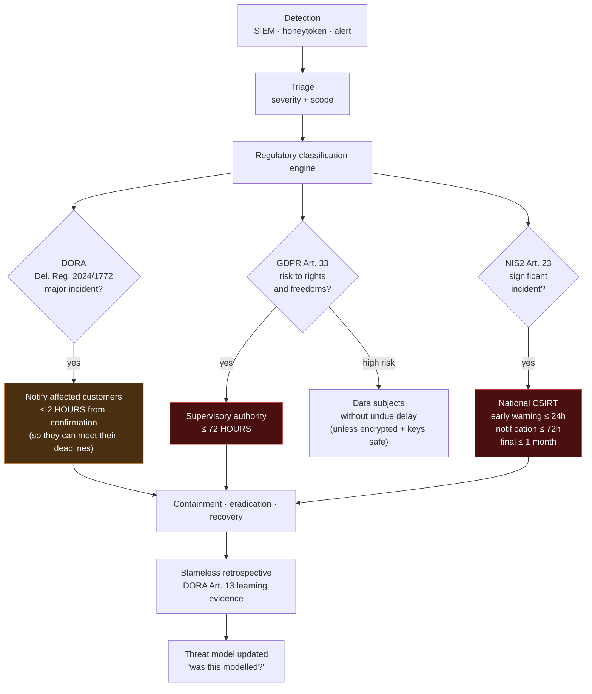
