# Architecture Diagrams

> **Baseline:** PRD v4.0. Diagrams show the **PRD-fixed** elements as concrete and everything else as role-labelled rather than product-labelled — region, compute platform, database engine, mesh, policy engine and AI provider are all unselected. See `reference-cloud-architecture` §3.

Mermaid source. Renders in GitHub, GitLab, VS Code and most documentation tooling.

**Every diagram below maps to a confirmed MVP security scope item.** Diagrams whose subject sits outside that scope were removed — see [What was removed](#what-was-removed) at the end.

| # | Diagram | Confirmed scope item it serves |
|---|---|---|
| D1 | System context | EU-only storage · AWS · Client-owned account · MFA · EU residency for AI inference |
| D2 | Account topology and data plane | AWS · Client-owned account · multi-tenant isolation · immutable audit log |
| D3 | Evidence access path — layered tenant isolation | Multi-tenant isolation · per-tenant keys · least-privilege roles · immutable audit logging |
| D4 | Upload pipeline | Secure document upload, malware inspection, sandboxed parsing |
| D5 | WSP mapping pipeline | Human approval of AI mappings · prompt-injection and hallucination controls · EU residency for inference |
| D6 | Key hierarchy | Per-tenant encryption keys · AES-256 at rest · non-deletable records |
| D7 | CI/CD trust zones and environment data rules | Secure SDLC · secrets management · vulnerability scanning · supply-chain controls |
| D8 | Record integrity chain | Immutable audit logging · non-deletable evidence and signed-off records |
| D9 | Backup and recovery topology | Secure backups and tested recovery (SLA/RTO/RPO remain proposals) |
| D10 | Record lifecycle | Non-deletable evidence and signed-off records |
| D11 | Incident handling | Incident monitoring and customer notification supporting DORA obligations |

---

## D1 — System context

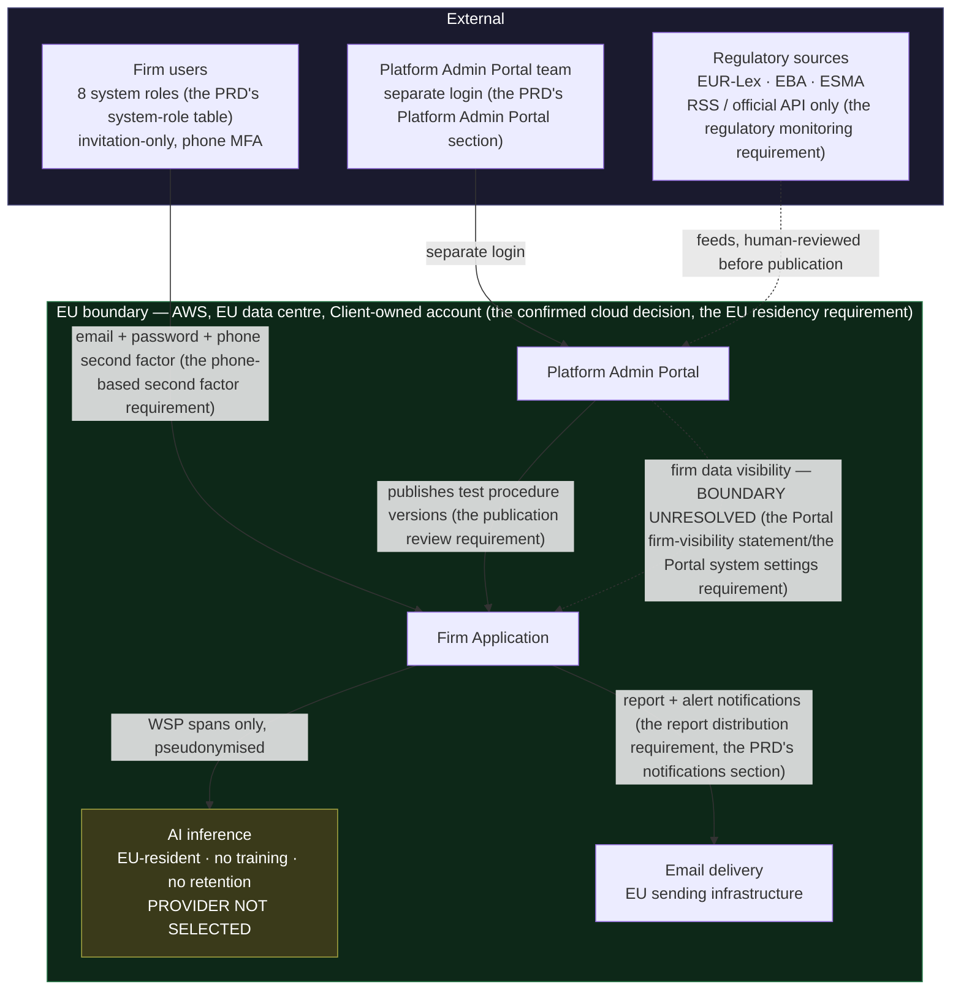

## D2 — Account topology and data plane

Account separation is what makes "no admin can delete the audit log" (the immutable audit requirement) and "no deletion path" (the non-deletable retention requirement) structural rather than procedural. Network-layer detail — subnet tiering, egress allowlisting, WAF tuning — is in [`supporting-topics/network-security`](supporting-topics/network-security.md).

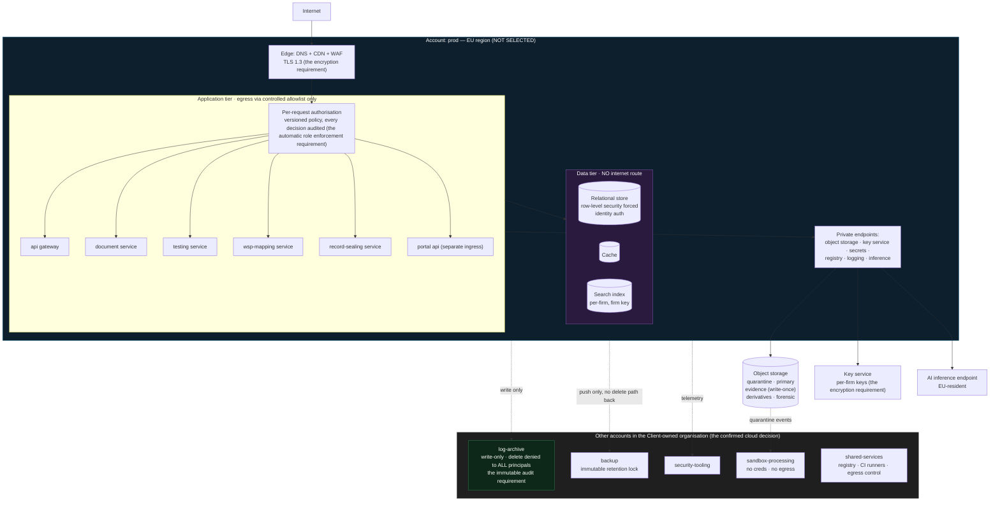

## D3 — Evidence access path: layered tenant isolation

Each numbered check is independent. Any one of them alone prevents cross-firm disclosure — that redundancy is the answer to the tenant isolation requirement. The enforcement-model rationale is in [`supporting-topics/zero-trust-architecture`](supporting-topics/zero-trust-architecture.md); the isolation requirement itself is `document-confidentiality`.

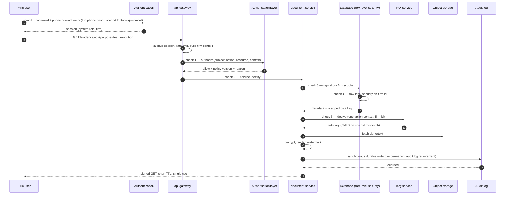

## D4 — Upload pipeline (the evidence file types the PRD lists, the configurable file-size limit size ceiling)

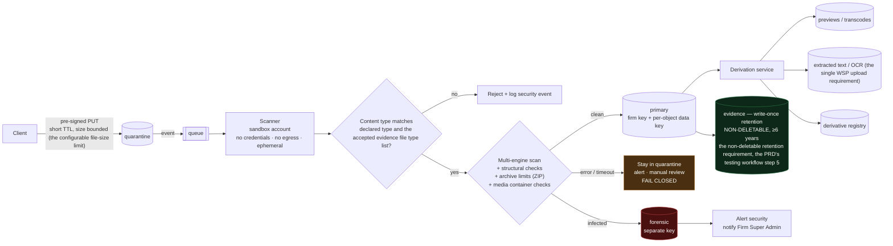

## D5 — WSP mapping pipeline (the only AI feature)

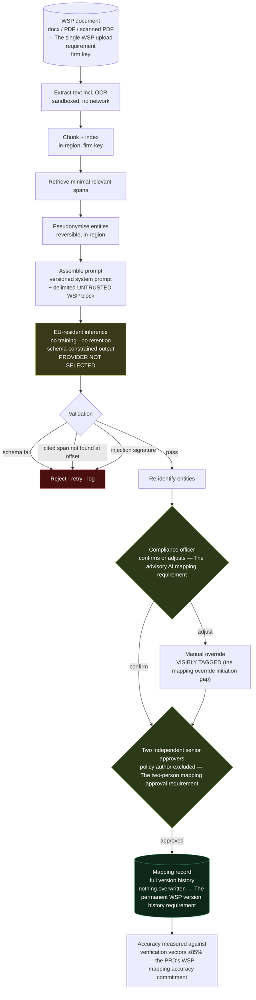

## D6 — Key hierarchy (the encryption requirement)

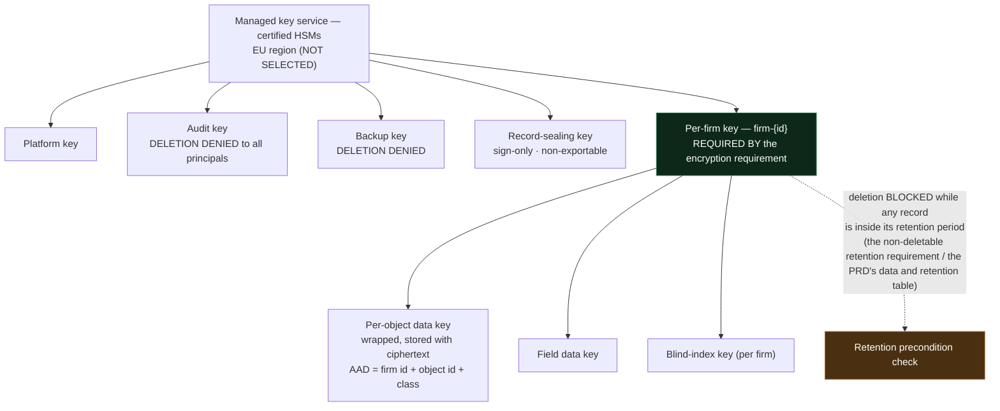

## D7 — CI/CD trust zones and environment data rules

```mermaid
flowchart LR
    subgraph Z1["Zone 1 — UNTRUSTED"]
        PR["Pull request"] --> V1["Hosted runners<br/>read-only token · NO credentials<br/>lint · test · cross-firm isolation tests ·<br/>immutability tests · SAST · SCA · secret scanning"]
    end
    subgraph Z2["Zone 2 — TRUSTED BUILD"]
        M["Merge<br/>2 reviewers · signed commits"] --> B["Ephemeral EU runner<br/>federated credentials → build role<br/>no client data, no firm key access"]
        B --> ART["Signed artefact + bill of materials<br/>+ provenance + scan attestation"]
    end
    subgraph Z3["Zone 3 — DEPLOY"]
        ART --> STG2["Pre-production<br/>admission verifies attestations<br/>SYNTHETIC DATA ONLY"]
        STG2 --> APR{"2 approvers"}
        APR --> CAN["Progressive rollout<br/>auto-rollback on regression"]
        CAN --> PRDE["Production — real client data<br/>NO standing human access<br/>pipeline identity only"]
        PRDE --> EVD2["Deployment record → immutable store"]
    end
    DEV["Developer workstations<br/>managed device · AI tooling governed<br/>SYNTHETIC DATA ONLY"] --> PR
    DEV -.->|"EXCEPTIONAL ONLY"| BG["Break-glass:<br/>dual approval · EU virtual desktop<br/>egress disabled · recorded · time-boxed"]
    BG -.-> PRDE
    V1 -.->|"never runs in Zone 2/3"| Z2

    style Z1 fill:#4a1010,stroke:#c04040,color:#fff
    style Z2 fill:#3a3a1a,stroke:#a0a040,color:#fff
    style Z3 fill:#0d2818,stroke:#2e7d4f,color:#fff
    style DEV fill:#3a3a1a,stroke:#a0a040,color:#fff
    style BG fill:#4a3010,stroke:#c08040,color:#fff
```

> Where development, support and administration are physically performed is **not stated by the PRD** and is an open question (`open-questions` L-1, detailed in [`supporting-topics/cross-border-data-processing`](supporting-topics/cross-border-data-processing.md)). The synthetic-data and zero-standing-access rules above are worth adopting regardless of the answer.

## D8 — Record integrity chain

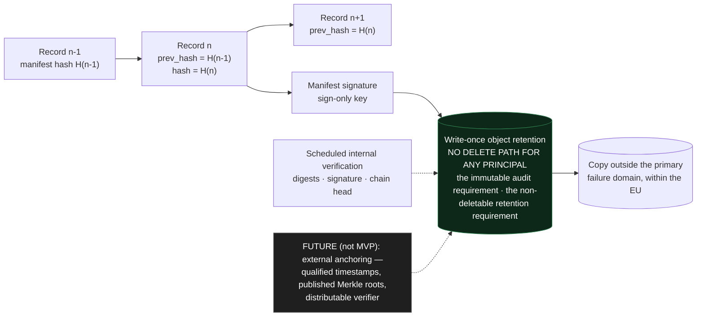

## D9 — Backup and recovery topology

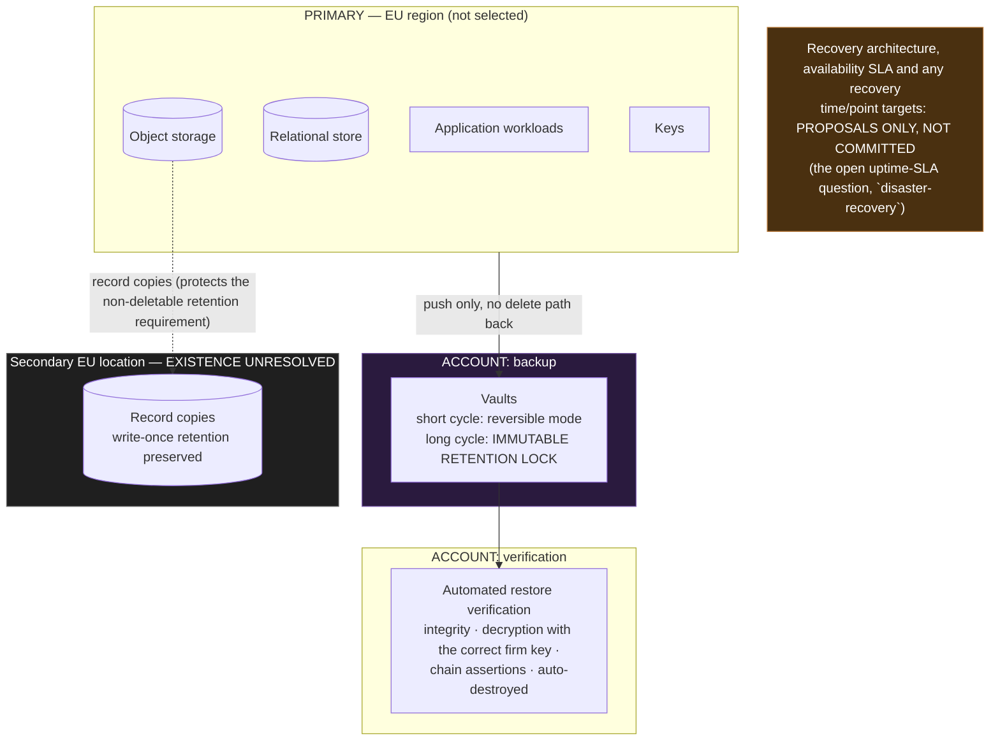

## D10 — Record lifecycle

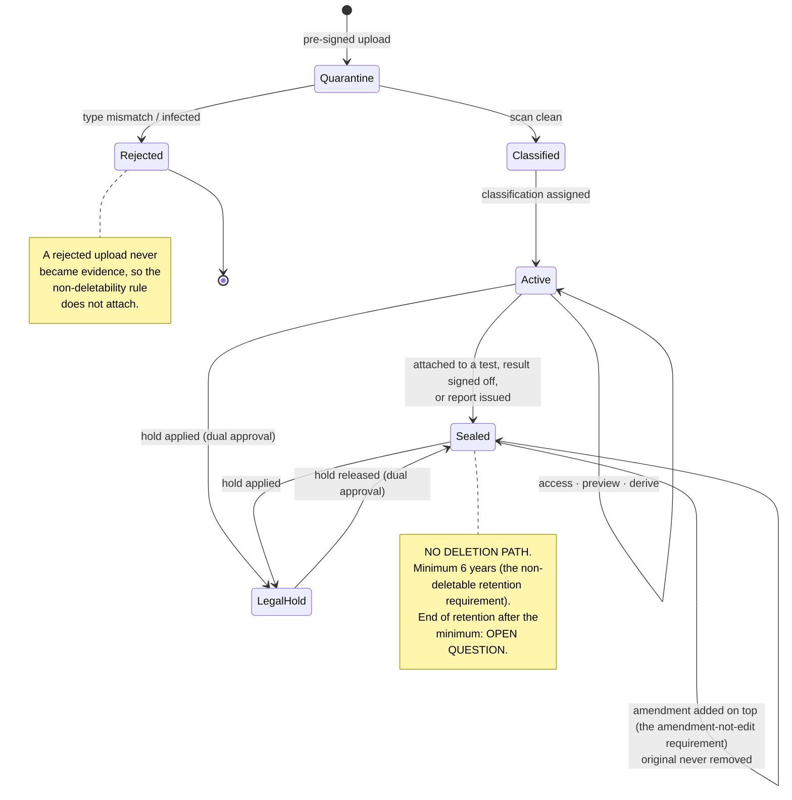

## D11 — Incident handling and customer notification

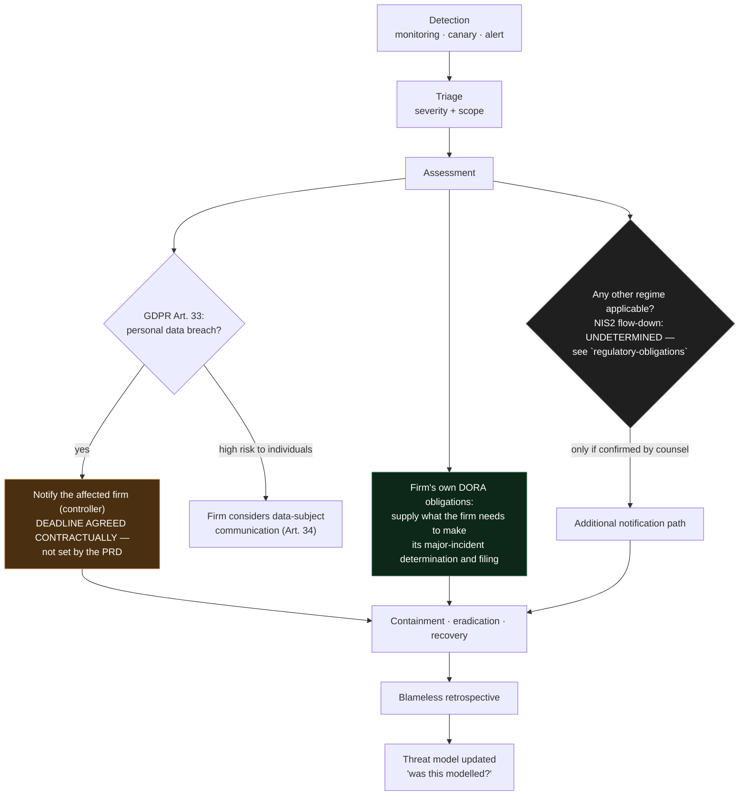

---

## What was removed

| Removed | Why | Where the content now lives |
|---|---|---|
| **Environment zones** (former D7) | Its primary subject — the boundary between development, pre-production and production, and *where* each is operated — is the unresolved delivery-topology question, which sits outside the confirmed scope | The still-relevant parts (synthetic data only outside production, zero standing production access, break-glass) are folded into **D7 — CI/CD trust zones and environment data rules**. Narrative in `secure-sdlc` and [`supporting-topics/cross-border-data-processing`](supporting-topics/cross-border-data-processing.md) |
| Network-layer internals of the former topology diagram — public/private subnet tiering, ingress, load balancer, DNS resolver firewall, WAF staging | Network security is outside the confirmed scope list; the account-and-data-plane view that *is* in scope was kept | [`supporting-topics/network-security`](supporting-topics/network-security.md) |

Nothing was deleted outright — every removed element is either folded into a retained diagram or described in text in the document named above.
