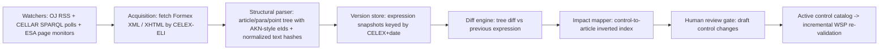

# Regulatory Ingestion & Change Detection Pipeline (Brief Section 11)

**Scope.** What EUR-Lex/ESMA/EBA actually offer in 2026 for machine ingestion of MiCA (EU) 2023/1114 and DORA (EU) 2022/2554 and their L2/L3 layers; reliability of amendment detection; the change-detection algorithm at article/paragraph granularity; control-impact mapping; human review gate.

**Date of research:** 2026-08-17. All URLs accessed 2026-08-17. MiCA fully applicable since 2024-12-30; DORA applies since 2025-01-17.

---

## 1. Source inventory (VERIFIED FACTS unless labeled)

### 1.1 EUR-Lex / Publications Office (CELLAR) — Level 1 + L2 acts in the OJ
- **CELLAR SPARQL endpoint** (public): queries all metadata in the Common Data Model (RDF/OWL), including relations between acts (amends/amended-by, corrigenda, legal basis). Output: JSON/XML/RDF. [Cellar data](https://op.europa.eu/en/web/cellar/cellar-data).
- **CELLAR RESTful content retrieval**: fetch manifestations of any act by CELEX/ELI URI — **XHTML, PDF, and Formex XML** (Formex is the Publications Office production format for the Official Journal; pre-2014 acts may only have Formex/PDF). [Cellar data](https://op.europa.eu/en/web/cellar/cellar-data), [Data extraction using web services (PDF)](https://eur-lex.europa.eu/content/tools/webservices/DataExtractionUsingWebServices.pdf).
- **EUR-Lex SOAP webservice** (search): free after user registration; WSDL provided. [Webservice help](https://eur-lex.europa.eu/content/help/data-reuse/webservice.html).
- **RSS**: predefined feeds (no registration) for e.g. Official Journal editions and new legislation; custom saved-search RSS/email alerts for registered users (max 50 saved searches). [RSS alerts help](https://eur-lex.europa.eu/content/online-learning/personalise-your-experience/rss-alerts.html), [My RSS feeds](https://eur-lex.europa.eu/content/help/my-eurlex/my-rss-feeds.html?locale=en). CELLAR also exposes RSS/ATOM feeds of repository updates. [CELLAR RSS/ATOM](https://op.europa.eu/en/web/cellar/cellar-data/rss-and-atom-feeds).
- **ELI point-in-time URIs**: each consolidated expression is addressable, e.g. `https://eur-lex.europa.eu/eli/reg/2023/1114/2024-01-09/eng` (MiCA as amended, expressed at 2024-01-09; CELEX `02023R1114-20240109`). [Consolidated MiCA](https://eur-lex.europa.eu/legal-content/EN/TXT/HTML/?uri=CELEX:02023R1114-20240109), [ELI summary](https://eur-lex.europa.eu/EN/legal-content/summary/european-legislation-identifier-eli.html).
- **Consolidation cadence — caveat**: the Publications Office consolidates "regularly", with no published SLA; the version date = applicability date of the latest incorporated amendment, and consolidated texts carry a "documentation tool only, no legal effect" disclaimer. So consolidation may **lag** OJ publication of an amending act by days–weeks. [Consolidated texts collection](https://eur-lex.europa.eu/collection/eu-law/consleg.html), [Consolidation glossary](https://eur-lex.europa.eu/EN/legal-content/glossary/consolidation.html). → Design consequence: **detect amendments from OJ metadata (authoritative, daily), not from consolidation appearance; use consolidation for diffing once available.**
- **AKN4EU**: interinstitutional Akoma Ntoso localization with an official Formex→AKN converter (FMX2AK); not the guaranteed retrieval format on EUR-Lex today — ingest Formex/XHTML, model structure AKN-style. [AKN4EU](https://op.europa.eu/en/web/eu-vocabularies/akn4eu).

### 1.2 ESMA (MiCA L2/L3 lead for securities-markets side)
- **Interactive Single Rulebook**: ESMA's online tool linking a Level-1 text to its delegated/implementing acts, RTS/ITS, guidelines, opinions and Q&As; MiCA is included. HTML tool — no documented public API. [ESMA ISRB](https://esma.europa.eu/publications-and-data/interactive-single-rulebook), [launch press release](https://www.esma.europa.eu/press-news/esma-news/esma-launches-interactive-single-rulebook).
- **Q&A tool**: stakeholders submit questions; ESMA publishes Q&As on practical application (e.g. 2025–26 MiCA Q&As on shared order book, execution-service classification). HTML pages; no structured export documented. [ESMA Q&As](https://www.esma.europa.eu/publications-and-data/questions-answers), [example](https://www.esma.europa.eu/press-news/esma-news/esma-puts-forward-qa-shared-order-book-model-under-mica).
- **News/press + document library**: RSS feed available on esma.europa.eu (ASSUMPTION: standard Drupal RSS at /rss.xml remains available — verify at deployment).

### 1.3 EBA (MiCA ART/EMT issuers; DORA joint-ESA lead)
- **Interactive Single Rulebook**: includes **DORA and MiCA** with L1 text linked to delegated/implementing acts, RTS/ITS, guidelines and Q&As. HTML tool. [EBA ISRB](https://www.eba.europa.eu/regulation-and-policy/single-rulebook/interactive-single-rulebook).
- **Single Rulebook Q&A**: public submission + published answers, including DORA Q&As; **HTML only, no JSON/CSV export / no API**. [EBA Q&A](https://www.eba.europa.eu/single-rule-book-qa).
- Press releases/news pages announce Q&A and rulebook additions (scrape/RSS).

### 1.4 European Commission
- Delegated acts / RTS-ITS adoptions appear in the **Official Journal** (→ EUR-Lex, authoritative trigger) and beforehand in Commission registers (comitology / delegated acts register) — useful **early warning**, but only OJ publication fixes text + entry-into-force. Digital-finance news page tracks the package. [Commission digital finance news example](https://finance.ec.europa.eu/news/digital-finance-2024-12-19_en).

### 1.5 Reliability assessment

| Change type | Detection channel | Reliability |
|---|---|---|
| L1 amendment / new amending regulation | EUR-Lex OJ daily + CELLAR SPARQL (`amends` relations on 32023R1114 / 32022R2554) | **High** (structured metadata, daily) |
| New delegated act / RTS / ITS in force | OJ publication + SPARQL (legal-basis = MiCA/DORA article) | **High** once in OJ; early-warning from ESA press = medium |
| New consolidated expression | CELLAR metadata for the 0-prefixed CELEX family (e.g. `02023R1114-*`) | High detection, **lagging** availability |
| ESMA/EBA guidelines | ESA websites + press RSS | Medium (HTML scraping) |
| Q&A additions/edits | ESA Q&A pages (HTML) — content-hash monitoring | **Medium-low**; no structured feed; edits without announcements possible |
| Effective/application dates | ELI/CDM date metadata + transitional provisions in text | Metadata dates high; **transitional regimes need human/legal reading** (REQUIRES LEGAL REVIEW) |

---

## 2. Ingestion pipeline (ARCHITECTURAL RECOMMENDATION)

**Watchers (daily):**
1. SPARQL query CELLAR for new resources whose CDM relations touch `32023R1114`, `32022R2554` (amends, corrects, is-based-on/legal-basis, completed-by) — catches amendments, corrigenda, and new L2 acts.
2. Poll for new members of the consolidated families `02023R1114-*`, `02022R2554-*`.
3. Predefined OJ RSS as a redundant channel.
4. ESA monitors: fetch ISRB pages, Q&A listing pages, guidelines pages; store normalized-HTML content hashes; alert on delta.

## 3. Change-detection algorithm ("what changed", article/paragraph granularity)

1. **Trigger**: new consolidated expression detected for a tracked CELEX family (or, before consolidation exists, a new amending act — in that case parse the amending act's instructions "Article X is replaced by…" as a provisional impact signal, flagged lower-confidence).
2. **Parse both expressions** (new vs. stored previous) from Formex XML preferentially (structure explicit), XHTML fallback, into a tree: `article → paragraph → point`, each node with a stable structural ID (`art_68__para_7__point_a`) and a normalized-text SHA-256 (whitespace/case/punctuation-normalized).
3. **Tree diff**: match nodes by structural ID; classify **modified** (same ID, hash differs), **added** (new ID), **deleted** (missing ID), **renumbered** (hash matches under different ID — detect via hash-to-ID reverse lookup before declaring add+delete pairs).
4. **Record a ChangeSet**: `{celex, old_expression_date, new_expression_date, eli_old, eli_new, changes:[{eid, type, old_hash, new_hash, snippet_ref}]}` — snippets referenced by ELI URI + eId, not bulk-copied.
5. **Effective dates**: take applicability date from ELI/CDM metadata of the amending act; where transitional provisions differ per article, mark `effective_date_confidence: low` → human review.
6. **Q&A/guidance changes** (no structure): page-level hash delta → extract the individual Q&A items, diff item lists by Q&A ID/title → ChangeSet with `authority_level: L3`.

## 4. Impact mapping ("which controls affected")

- Maintain the **control→article inverted index** built from every control's CELEX+eId anchors (see control-model.md §3), including `related_provisions` (L2) and `guidance_refs` (L3).
- For each ChangeSet entry, look up `(celex, eid)` → affected control IDs. Also match at coarser granularity (whole article) to catch controls anchored at paragraph level when a sibling paragraph changes context (configurable blast radius: exact eId, parent article, cross-references).
- Cross-reference expansion: provisions citing the changed article (extracted citation graph from parsed text; CELLAR metadata for act-level relations) — second-ring impact, lower priority.
- Output: **Impact Report** per ChangeSet: affected controls, severity heuristic (deleted/modified obligation > added recital), and affected WSP sections (via existing control→WSP-finding links) queued for incremental re-validation.

## 5. Human review gate (mandatory)

1. Diff + impact report lands in a **review queue**; no control catalog change is auto-activated.
2. A compliance analyst reviews: confirms provision-change interpretation, edits/creates draft control versions, sets effective dates, marks items REQUIRES LEGAL REVIEW where interpretation is contested (e.g. transitional regimes, L3-only bases).
3. Approval creates new immutable control versions (`lifecycle.approved_by/at`, `change_reason` = ChangeSet ID) and triggers **incremental re-validation** only of WSPs/ sections mapped to affected controls.
4. Everything audit-logged: source URL, ELI expression pair, diffs, reviewer, decision — supports evidence-backed findings later.
5. SLA suggestion (ASSUMPTION, tune with ops): triage within 2 business days of OJ-detected L1/L2 change; 5 days for L3.

## 6. Open questions

- **OPEN QUESTION**: exact consolidation lag for MiCA/DORA amendments in practice (no published SLA) — measure empirically; interim mitigation = parse amending-act instructions directly.
- **OPEN QUESTION**: whether ESMA/EBA will expose structured feeds for ISRB/Q&A (none documented as of 2026-08-17); until then HTML monitoring with hash-diffing, acknowledged medium-low reliability.
- **REQUIRES LEGAL REVIEW**: authority weighting of Q&As/guidelines vs. binding RTS in findings shown to customers.
- Note: ingested regulatory HTML/PDF is still **untrusted input** to LLM steps — same prompt-injection handling as sample WSP PDFs.
