# ComplianceIQ — AI Engine Architecture

**Version:** 1.1
**Status:** Draft for architecture review
**Date:** 2026-09-07
**Depends On:** Technical Architecture Baseline (TAB) v2.0, AI & Document Intelligence v1.1, Database Architecture v1.2, Backend Architecture v1.1, Domain Model & Ubiquitous Language v1.0, Architecture Decision Records v1.1
**Consumes research from:** `docs/research/WSP Analysis/ai/rag-architecture.md`, `regulatory/regulatory-ingestion.md`, `regulatory/control-model.md`
**Audience:** AI Engineers, Backend Engineers, Architects, Compliance SMEs, QA

> **What this document adds.** *AI & Document Intelligence v1.1* fixes the AI Service's **internal structure** (modules, provider abstraction, prompt registry, eval harness). This document fixes the **AI Engine as a system**: the seven processes it is made of, every data store they read and write, the data flows between them and the outside world, and the control flow that sequences them. It is the diagram-level specification — a Level 0/1/2 data flow decomposition plus supporting behavioural models — that the two documents above reference but do not contain.
>
> Where this document and an earlier one disagree, that disagreement is called out explicitly in **§12 Reconciliations & Open Decisions** rather than silently resolved.

---

# 1. Scope and Definitions

## 1.1 What "the AI Engine" is

The AI Engine is the set of processes that turn **two untrusted document streams** into **evidence-backed, human-reviewable compliance verdicts**, and that keep those verdicts current as the law changes:

- **Stream A — the law.** EU regulations (MiCA (EU) 2023/1114, DORA (EU) 2022/2554) and their Level-2/Level-3 layers, fetched from official sources, parsed to article/paragraph granularity, hashed, versioned, and diffed.
- **Stream B — the firm's procedures.** Written Supervisory Procedures (WSP) manuals — 150–200pp firm-confidential PDFs — parsed into a section tree, chunked, embedded and indexed.

The engine's output is never a compliance decision. Per TAB v2.0 §10.1 and Domain Model §9, **every AI output that affects compliance status is written as `pending_review`**. The engine produces *candidate* mappings, *candidate* verdicts, and *candidate* control changes; a human confirms, edits, or rejects each one.

## 1.2 Two distinct AI tasks, deliberately chained

An ambiguity worth removing up front: the existing documents describe two different AI outputs in two different vocabularies, and they are not the same task.

| | **Task M — Coverage Mapping** | **Task E — Adequacy Evaluation** |
|---|---|---|
| Question answered | "Which Requirement(s) does this WSP section address?" | "Does the firm's WSP satisfy this Control, and where is the evidence?" |
| Direction | WSP section → Requirement | Control → WSP evidence |
| Output | `ai_mapping` suggestion + confidence 0–1 | Verdict `PASS / PARTIAL / FAIL / NOT_APPLICABLE / NEEDS_HUMAN_REVIEW` + citations |
| Defined in | AI & Document Intelligence §5 | `ai/rag-architecture.md` §19 |
| Gate | Floor 0.4; always `pending_review` | Verification gate + confidence policy; always `pending_review` |
| Feeds | Gap analysis (FR-34) — set difference over confirmed mappings | Findings, severity, remediation, alerts |

**Both are in scope for the AI Engine and they chain.** Task M establishes *what the manual talks about* and produces the coverage picture the dashboard needs; Task E establishes *whether what it says is good enough* against a specific control, and is what produces citable findings. Task M is cheap and runs over every section on upload; Task E is expensive and runs per applicable control. Task M's confirmed mappings are a retrieval prior for Task E (they narrow the candidate section set), but Task E does **not** depend on Task M having been human-confirmed first — it retrieves independently, so an unmapped section can still be found as evidence.

## 1.3 Notation used in this document

Data Flow Diagrams follow Yourdon/DeMarco conventions, rendered in Mermaid. Mermaid has no native DFD type, so **shape is the primary encoding and colour is redundant reinforcement** (this keeps the diagrams readable in greyscale print, in the generated .docx, and for colour-vision-deficient readers):

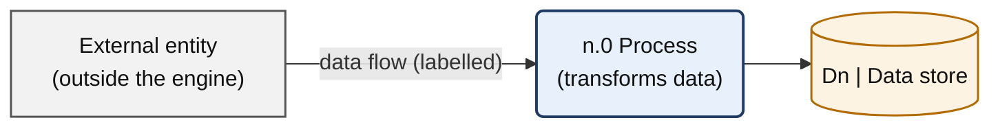

- **Sharp rectangle** = external entity (a source or sink outside the engine's control).
- **Rounded rectangle** = process (numbered `n.0` at Level 1, `n.m` at Level 2).
- **Cylinder** = data store.
- **Red-stroked node** = mandatory human gate.
- **Purple-stroked node** = a call that leaves the engine to an LLM/embedding provider (i.e. a cost and residency event).

Every diagram in this document is also exported standalone — `.mmd` source plus rendered `.svg` — to `docs/tech-spec/ai-engine-diagrams/`, because `scripts/archmd2docx.py` renders Mermaid fences as code blocks rather than pictures. The Markdown here remains the source of truth.

DFDs show **data at rest and in motion, not sequencing**. Control flow is given separately in §8 (sequence diagram) and §9 (state machines).

---

# 2. Verified Ground Truth — The Shape of Incoming Regulatory Data

The regulatory side of the engine is not speculative. `scripts/fetch_regulation.py` is a working spike against the live Publications Office CELLAR endpoint, and its output pins the data contract for Process 1.0.

**Run:** `python3 scripts/fetch_regulation.py` (2026-09-07, live endpoint)

| Act | CELEX | Zip parts | Articles | Annexes | OJ | Published |
|---|---|---|---|---|---|---|
| DORA | `32022R2554` | 2 | **64** (`001`–`064`) | 0 | L 333 | 2022-12-27 |
| MiCA | `32023R1114` | 8 | **149** (`001`–`149`) | **6** (ANNEX I–VI) | L 150 | 2023-06-09 |

**Facts established by the spike that the architecture depends on:**

1. **Formex XML is retrievable per-act by CELEX over plain HTTP** from `http://publications.europa.eu/resource/celex/{celex}`, content-negotiated to a zip of XML parts. This satisfies **ADR-026** (official APIs only, no HTML scraping) for Level-1 and Level-2 acts.
2. **An explicit `User-Agent` header is mandatory** — the default `python-requests` agent receives HTTP 403. This is a hard requirement on the fetcher, not a courtesy.
3. **The natural ingestion unit is the article**, with paragraphs beneath it. Each `<ARTICLE>` carries a stable Formex `IDENTIFIER` (`017`), a title (`Article 17`), a heading (`ICT-related incident management process`), and a chapter path derived from its `<DIVISION>` ancestors.
4. **`content_hash` (SHA-256 of normalised text) is the change-detection primitive** and is computed at both article and paragraph level. Page-break processing instructions (`<?PAGE NO="40"?>`) are not emitted by `itertext()`, so hashes stay stable across re-publication of the same text.
5. **Consolidated expressions have a different root** (`<CONS.ACT>` vs `<ACT>`) and carry `<INFO.CONSLEG>` stamps (`START.DATE`, `DATE.LAST.MOD`). The 0-prefixed CELEX form (`02023R1114-20240109`) is the point-in-time text — **this, not the as-published text, is what the diff engine compares across runs.**
6. **Amending acts quote replaced text inside `QUOT.S` blocks.** Articles nested in those blocks belong to the *amended* act and must be skipped, or the ingest will fabricate phantom articles. The spike already implements this exclusion.
7. **`in_force_date` is absent from Formex.** Only OJ publication and signature dates are carried. In-force and application dates must come from CDM/ELI metadata via SPARQL — a second call, not a parse.
8. **Amendment detection is a SPARQL query, not a diff**: `cdm:resource_legal_amends_resource_legal` / `resource_legal_corrects_resource_legal` against the tracked CELEX numbers gives the authoritative daily signal, ahead of consolidation (which has no published SLA and may lag by days to weeks).

**The record contract Process 1.0 emits** (from the spike's dataclasses, which become the persisted schema):

```python
ArticleRecord(
    celex, short_name, part,
    article_id,      # "017"           — Formex IDENTIFIER, the eId root
    label,           # "Article 17"
    heading,         # "ICT-related incident management process" | None
    chapter_path,    # ["TITLE III …", "CHAPTER I …"]  — ordered, outermost first
    text,            # normalised plain text
    content_hash,    # sha256(text)    — the revalidation key
    paragraphs=[Paragraph(paragraph_id, number, text, content_hash), …],
)
AnnexRecord(celex, short_name, part, label, heading, text, content_hash)
```

**Scale implication.** 213 articles across the two acts is a small corpus. The engine's cost is driven almost entirely by the *firm* side — controls × WSP sections × firms — not by the regulatory side. This is why §10 puts the caching and reuse machinery on the evaluation path, not the ingestion path.

---

# 3. Level 0 — Context Diagram

The whole AI Engine as one process, with everything it exchanges data with.

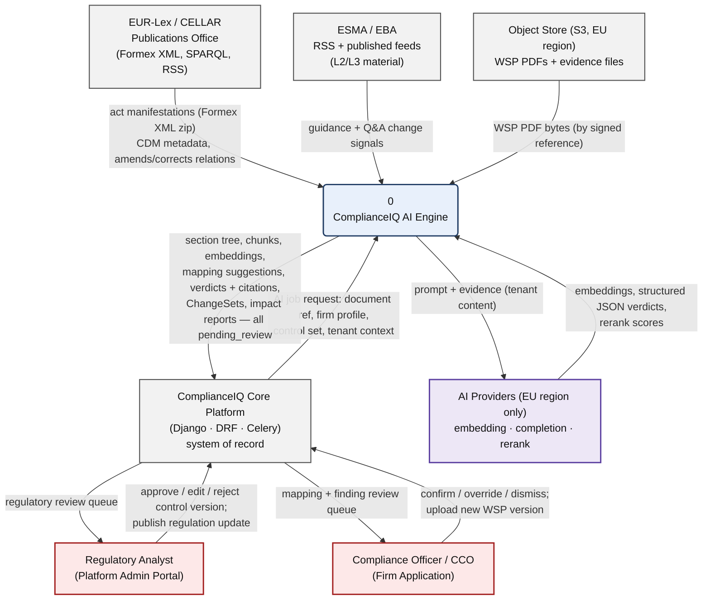

**Three properties fixed at this level:**

1. **The engine never talks to a firm user directly.** All human interaction is mediated by the Django platform, which owns authentication, tenant scoping, and the review queues. The engine has no UI and no session concept.
2. **Every arrow into `PROV` is a cost event and a data-residency event.** The provider gateway (§7.2) is the only place these arrows originate, and it refuses non-EU routing for any payload flagged as tenant content (AI & Document Intelligence §6.2).
3. **The engine has no authority.** Both human entities receive *proposals*. There is no flow from the engine to a published regulation, a closed finding, or a confirmed mapping.

---

# 4. Level 1 — The AI Engine Decomposed

Seven processes and ten data stores.

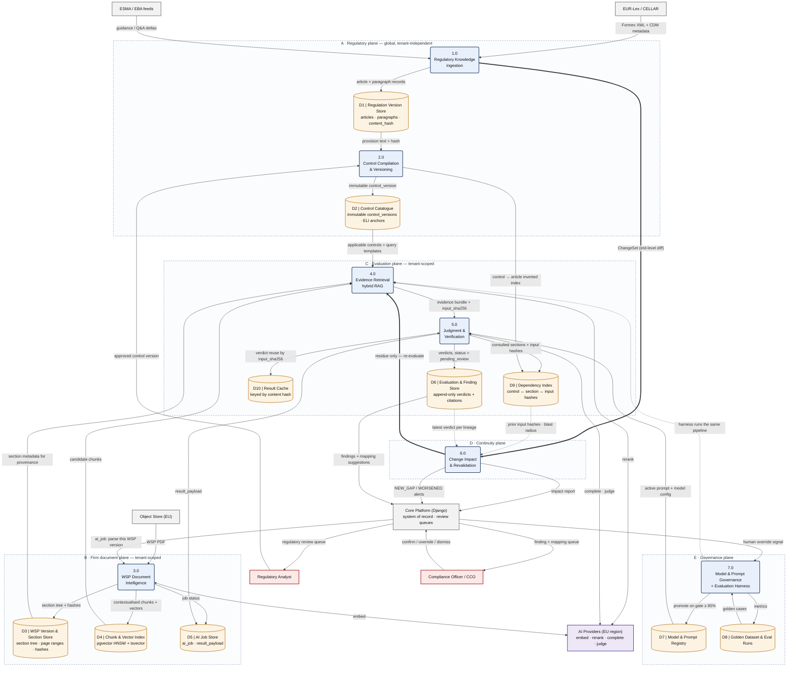

## 4.1 Process responsibilities

| # | Process | Owns | Does **not** do |
|---|---|---|---|
| **1.0** | Regulatory Knowledge Ingestion | Fetch, parse, hash, version official regulatory text; detect amendments via SPARQL; emit ChangeSets at eId granularity | Interpret legal meaning; publish a regulation; decide impact |
| **2.0** | Control Compilation & Versioning | Turn approved Requirements into immutable, ELI/CELEX-anchored `control_version` records with expected evidence and retrieval queries; maintain the control→article inverted index | Author controls autonomously — every version passes the analyst gate |
| **3.0** | WSP Document Intelligence | Parse, OCR-fallback, normalise, build the section tree, hash sections, chunk section-aware, contextualise, embed, index; scan for injected content | Judge compliance; write to tenant tables directly (§12.1) |
| **4.0** | Evidence Retrieval | Per-control hybrid retrieval (dense + BM25 → RRF → cross-encoder rerank → parent-section expansion); negative-evidence detection | Generate text; decide verdicts |
| **5.0** | Judgment & Verification | Assemble prompts, obtain schema-constrained JSON, run the deterministic anti-hallucination gate, compute composite confidence, apply the threshold policy | Auto-confirm anything; invent page/section numbers |
| **6.0** | Change Impact & Revalidation | Map ChangeSets to impacted controls and firms, compute blast radius, decide reuse vs re-run per input hash, batch the residue, diff run-over-run, classify alerts | Approve a control change; suppress a finding |
| **7.0** | Model & Prompt Governance + Eval Harness | Version prompts/models, run the golden-dataset harness, enforce the ≥85% promotion gate, track production override rate | Promote a configuration that fails the gate |

## 4.2 Data store ownership

| Store | Physical home | Written by | Read by | Retention |
|---|---|---|---|---|
| D1 Regulation Version Store | Shared schema (Postgres) | 1.0 | 2.0, 5.0, 6.0 | Permanent, append-only per expression |
| D2 Control Catalogue | Shared schema | 2.0 | 4.0, 5.0, 6.0, 7.0 | Permanent, immutable versions |
| D3 WSP Version & Section Store | Tenant schema | 3.0 (via Django) | 4.0, 5.0, 6.0 | Per tenant retention policy; no delete grant |
| D4 Chunk & Vector Index | Tenant schema, `wsp_content_embedding_genN` + GIN tsvector | 3.0 (via Django) | 4.0 | Regenerated per embedding generation |
| D5 AI Job Store | Tenant schema, `ai_job` | 3.0, 5.0, 7.0 | Django, audit | No delete grant — evidentiary trail |
| D6 Evaluation & Finding Store | Tenant schema | 5.0 | Django, 6.0 | Append-only; verdicts never mutated |
| D7 Model & Prompt Registry | Shared schema | 7.0 | 5.0, 4.0 | Permanent; one `active` per template |
| D8 Golden Dataset & Eval Runs | Shared schema | 7.0 | 7.0 | Versioned datasets, permanent runs |
| D9 Dependency Index | Tenant schema | 2.0, 5.0 | 6.0 | Latest evaluation per (control, section) |
| D10 Result Cache | Redis + durable fallback in D5/D6 | 3.0, 5.0 | 4.0, 5.0, 6.0 | TTL-free; keyed by content hash, invalidated by hash change |

---

# 5. Level 2 — Process Decompositions

## 5.1 DFD 1.0 — Regulatory Knowledge Ingestion

Directly implements the verified spike (§2). ADR-026-compliant: every source here is an official API or feed, not a scraped page layout.

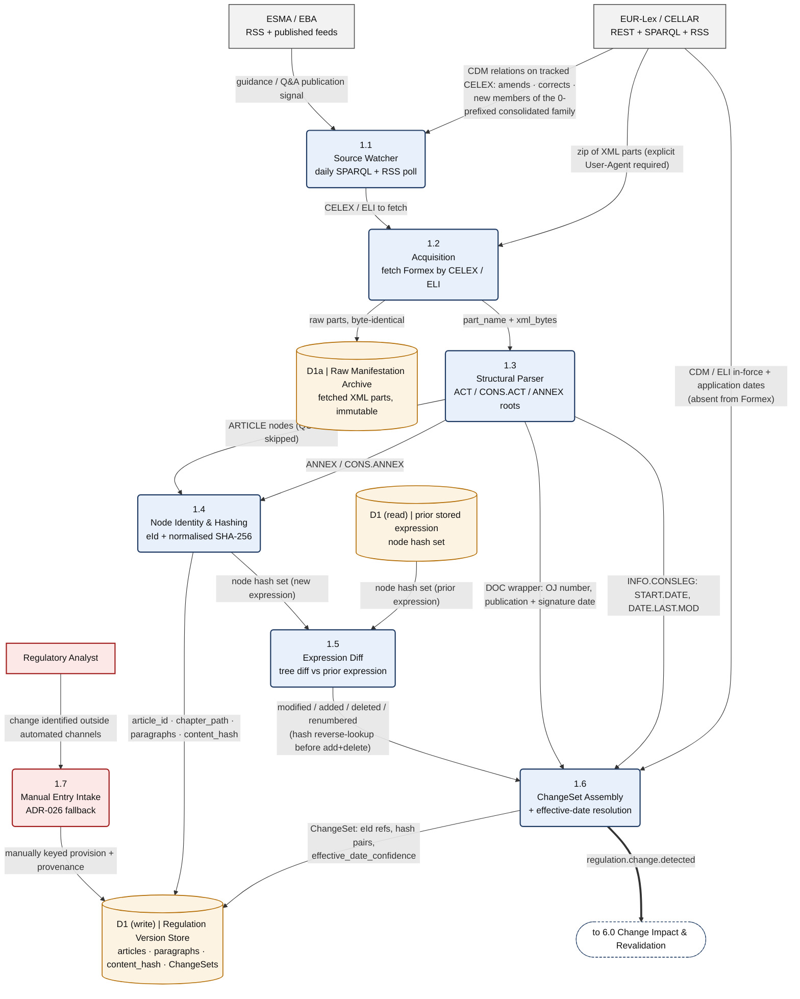

**Design notes**

- **D1 appears twice by convention.** A DFD may draw the same data store more than once to keep the flow readable; `D1 (read)` and `D1 (write)` are the same Regulation Version Store. The read side supplies the *prior* expression's node hash set, the write side receives the *new* one.
- **Amendment detection leads consolidation.** 1.1's SPARQL poll on `amends`/`corrects` fires the day an amending act hits the OJ. The consolidated expression used for the actual diff may not exist yet — no published SLA. Until it does, 1.5 runs in *provisional mode* against the amending act's own instructions ("Article X is replaced by…") and marks the ChangeSet `confidence: provisional`, which 6.0 treats as review-only, never as auto-invalidation.
- **Renumbering is detected before add/delete.** 1.5 reverse-looks-up unmatched hashes before classifying: a paragraph that moved from `art_68__para_7` to `art_68__para_8` with an identical hash is a *renumber*, not a delete plus an add. Getting this wrong would fire a spurious blast radius across every control anchored on that paragraph.
- **The raw archive (D1a) is immutable and byte-identical.** It exists so any historical finding can be re-derived from the exact manifestation that produced it, which is what makes a verdict defensible years later.
- **Ingested regulatory text is untrusted input.** Regulatory XML reaches LLM prompts in later processes; it is handled as data, never as instruction (§7.4).

## 5.2 DFD 3.0 — WSP Document Intelligence

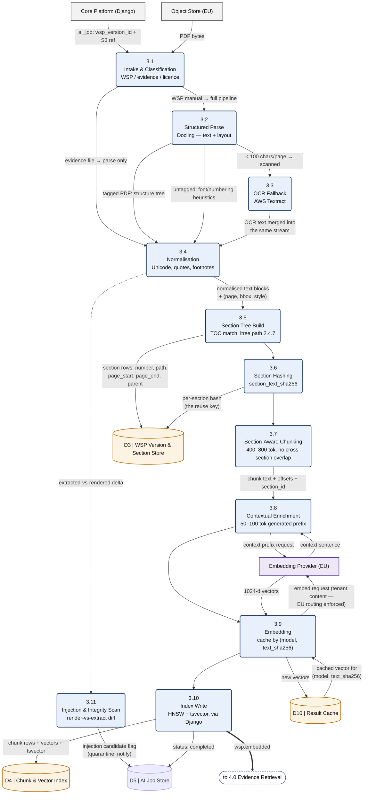

**Design notes**

- **Two extraction paths are both required.** The sample manuals differ materially: one is a tagged PDF with a real structure tree and a deep numbered TOC (`2.4.7`), the other is untagged and produced by PDFium, where headings must be inferred from font size, weight and numbering regexes. Tagged structure is the preferred signal when present; the heuristic path is not a fallback for rare cases, it is the common case.
- **Chunk boundaries never cross a section boundary.** A finding cites `filename + page + section`; a chunk spanning two sections makes that citation unresolvable. Overlap exists only *within* a section.
- **Tables are a distinct chunk type.** WSP supervisory-responsibility matrices (who reviews what, how often, evidenced how) are the highest-value evidence in the document. They are serialised with a repeated header row per slice, prefixed with a generated one-sentence description, and the raw cell grid is stored separately so 5.0's verification gate can re-check cell-level claims against the grid rather than the serialisation.
- **3.11 runs on every document, not on suspicion.** A WSP is a customer-supplied file whose text reaches an LLM prompt. Hidden-text and render-vs-extract divergence are the detection signal for prompt injection (OWASP LLM01).

## 5.3 DFD 4.0 — Evidence Retrieval

Retrieval is driven by the **control**, not by a free-form user question. Each control ships its own query templates and synonym sets, so this process runs once per applicable control per WSP version.

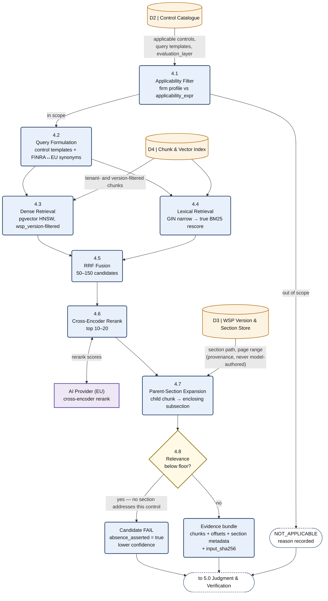

**Design notes**

- **Applicability filtering is the first and cheapest cost lever.** A control that does not apply to the firm's activity profile never reaches retrieval, never reaches a model, and is recorded as `NOT_APPLICABLE` with a stated reason rather than silently skipped.
- **Absence of evidence is a finding, not a null.** If reranked relevance never clears the floor, 4.8 emits a *candidate FAIL* with `absence_asserted: true` rather than returning nothing. A missed gap is the worst error class this product can produce, so the pipeline is built to name the gap instead of falling silent.
- **Lexical retrieval is not optional.** Compliance evidence turns on exact terms of art — "ICT third-party service provider", "Article 17", "AMLCO". Dense retrieval alone under-ranks these; the GIN-narrowed BM25 rescore is what catches them.
- **Provenance enters here, from the store — never from a model.** 4.7 attaches section path and page range from D3 so that 5.4 has real metadata to copy.

## 5.4 DFD 5.0 — Judgment and the Verification Gate

The only process in the engine that asks a model for a judgment, and the only one that has to assume the answer may be wrong.

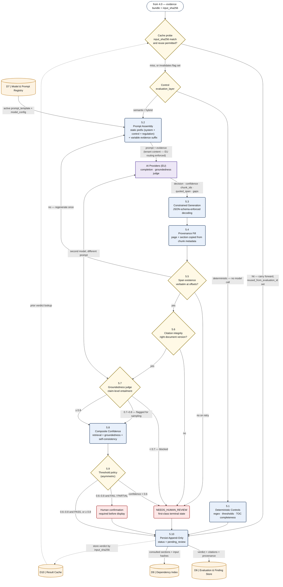

**Design notes**

- **Three evaluation layers, cheapest first.** Layer 1 (5.1) is deterministic and never calls a model — retention periods, numeric thresholds, TOC completeness, stale citation detection. Layer 2 is retrieval (4.x). Layer 3 (5.2–5.3) is the LLM. A control declares which layer it needs; only semantic and hybrid controls reach Layer 3. This is the single largest cost lever in the engine.
- **The cache probe precedes everything.** An exact `input_sha256` match with no `invalidates` flag carries the prior verdict forward at zero model cost, recording `reused_from_evaluation_id` so the reuse is auditable rather than invisible.
- **The model selects chunks; the system fills provenance.** 5.4 populates `page` and `section` from stored chunk metadata. The LLM is never permitted to author a page number — it can only reference a `chunk_id` that already exists.
- **5.5 and 5.6 are deterministic, not model calls.** Span existence is a normalised string match at recorded offsets; citation integrity is a foreign-key check against the document version. Only 5.7 is a second model, and it runs a *different* prompt and ideally a different model from 5.3.
- **The confidence policy is deliberately asymmetric.** PASS may auto-decide in the 0.6–0.8 band; FAIL and PARTIAL may not. A false PASS is a compliance risk that surfaces at examination time; a false FAIL is an analyst-trust cost that surfaces immediately. They are not symmetric errors and the thresholds should not pretend they are.
- **Constrained decoding is necessary but not sufficient.** Schema-enforced decoding removes malformed JSON, not schema violations: published benchmarks put raw JSON validity near 98% but full schema compliance at roughly 91–96%, and one 2026 measurement reports a ~99.97% JSON pass rate against a perfect-response rate near 0.49. At a few percent per verdict across thousands of verdicts, a schema-invalid response is a routine event, not an exception — 5.3 therefore has an explicit path: revalidate against the schema, regenerate once, then `NEEDS_HUMAN_REVIEW`. It is never a silent parse failure or a dropped control.
- **Verification is a cascade, not a single judge.** Per-claim LLM verification is a first-order cost line, not a free safety net — measured per-claim costs in 2025 work range from roughly $0.06 with a cheap model to over $1.00 with a frontier one, and a 150–200pp WSP decomposes into hundreds of claims. 5.5 and 5.6 are deterministic and run on everything; 5.7's model-based judge is reserved for what survives them and is itself budgeted (see §7.1).
- **The model's own confidence is not an input to 5.8.** Predictive probability and verbalized confidence are measurably overconfident even for a strong judge (ECE ≈ 0.22, failure-prediction AUROC as low as 0.55); an agreement-based estimator — sampling several simulated annotators and scoring confidence as their agreement ratio — roughly halves calibration error. The composite in 5.8 is therefore built from retrieval strength, groundedness and inter-sample agreement, all system-measured. A `confidence` number the model writes about itself is recorded for diagnostics and never used to route a verdict.
- **`pending_review` is unconditional.** Nothing on this diagram writes a confirmed compliance state. The `auto-decision` branch means "no analyst confirmation required before the finding is *shown*", not "the finding is *accepted*".

## 5.5 DFD 6.0 — Change Impact and Incremental Revalidation

This is the process that makes the product *continuous* rather than a one-shot audit tool.

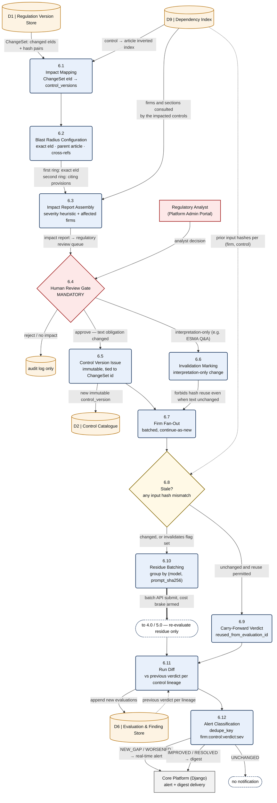

**Design notes**

- **The dependency index (D9) is what makes revalidation cheap.** Every evaluation records which sections it consulted and the hash of each input (`section_text_sha256`, `reg_text_sha256`, `prompt_sha256`, `model_id`). A regulation change re-runs only the `(firm, control)` pairs where at least one of those hashes now differs. Without D9 the only correct response to any change is a full re-evaluation of every firm.
- **"Invalidates" defeats hash reuse deliberately.** An ESMA Q&A can change what a provision *means* without changing a single byte of its text. In that case every input hash still matches, and reuse would silently carry forward a verdict that is now wrong. 6.6 sets a flag that forces re-evaluation regardless of hashes — this is the one place where hash-equality is not sufficient.
- **Alert classification is a run-diff, not a verdict property.** A `FAIL` that was already `FAIL` last run is not an alert; it is the existing state of a tracked finding. Only transitions — `NEW_GAP`, `WORSENED` — interrupt anyone. This is what keeps the platform usable after the first month.
- **The gate at 6.4 is not skippable, even for "obvious" changes.** No control version reaches the active catalogue without an analyst approving the interpretation, per ADR-011 and ADR-026.

## 5.6 DFD 7.0 — Governance and the Evaluation Harness

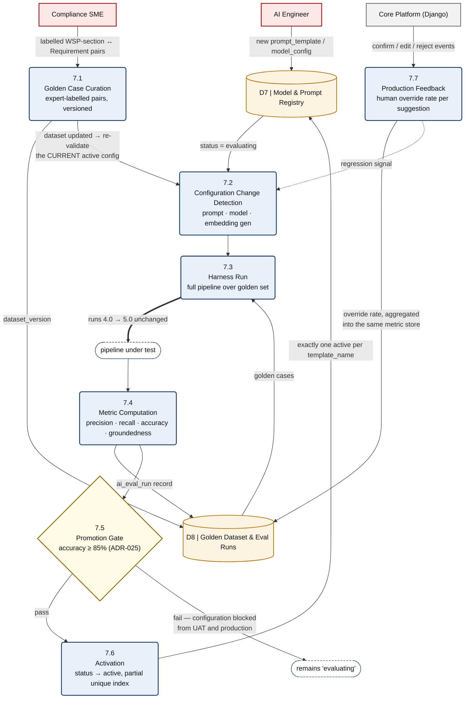

**Design note — the dataset-update trigger is the subtle one.** 7.2 fires not only when a *configuration* changes but when the *golden dataset* changes. Re-running the currently-active configuration against an improved dataset catches silent regressions: the config that passed at 87% against last quarter's 40 cases may sit at 79% against this quarter's 90 cases, and nobody changed a prompt. Without this trigger the 85% commitment decays quietly.

---

# 6. Data Contracts

The three contracts that cross a process boundary and must therefore be stable.

## 6.1 Regulatory provision record (1.0 → D1)

Pinned by the spike (§2). Persisted shape:

```jsonc
{
  "celex": "32022R2554",
  "short_name": "DORA",
  "expression": {
    "celex_expression": "02022R2554-20250117",   // 0-prefixed = consolidated
    "eli_expression": "http://data.europa.eu/eli/reg/2022/2554/2025-01-17/eng",
    "start_date": "2025-01-17",                   // INFO.CONSLEG START.DATE
    "publication_date": "2022-12-27",             // OJ, from <DOC> wrapper
    "in_force_date": null                         // NOT in Formex — from CDM/ELI
  },
  "article": {
    "article_id": "017",                          // Formex IDENTIFIER
    "eid": "art_17",                              // AKN-style, derived
    "label": "Article 17",
    "heading": "ICT-related incident management process",
    "chapter_path": ["TITLE III …", "CHAPTER I …"],
    "text": "…normalised plain text…",
    "content_hash": "sha256:…",                   // the revalidation key
    "paragraphs": [
      {"paragraph_id": "017.001", "eid": "art_17__para_1",
       "number": "1.", "text": "…", "content_hash": "sha256:…"}
    ]
  }
}
```

## 6.2 Control version (2.0 → D2)

Custom JSON with ELI/CELEX provenance — OSCAL's *architecture* (catalog / control / assessment objective) without its US-flavoured serialisation, because OSCAL has no native point-in-time EU legal versioning. Full rationale in `regulatory/control-model.md` §1–2.

```jsonc
{
  "control_id": "DORA-ART17-C03",
  "version": 3,
  "hierarchy": {
    "regulation": {"celex_base": "32022R2554",
                   "celex_consolidated": "02022R2554-20250117"},
    "requirement": {"akn_eid": "art_17__para_1",
                    "text_sha256": "sha256:…",     // pinned: cheap "did it change?"
                    "obligation_type": "obligation",
                    "addressee": ["financial entity"]}
  },
  "applicability": {"entity_types": ["CASP"], "conditions": ["provides custody"]},
  "evaluation_layer": "semantic",                  // deterministic | semantic | hybrid
  "expected_evidence": [
    {"evidence_id": "EE-1",
     "description": "WSP section defining ICT incident classification criteria",
     "wsp_signals": ["incident classification", "severity", "escalation timeline"]}
  ],
  "retrieval": {"query_templates": ["ICT incident classification criteria"],
                "synonym_sets": ["finra_eu_bridge_v2"]},
  "severity_if_absent": "high",
  "lifecycle": {"status": "active", "effective_from": "2025-01-17",
                "supersedes": "DORA-ART17-C03@v2",
                "change_reason": "changeset:…", "approved_by": "…"}
}
```

## 6.3 Verdict envelope (5.0 → D6)

The output of the whole engine. Every field is either model-selected or system-filled — never both.

```jsonc
{
  "control_id": "DORA-ART17-C03", "control_version": 3,
  "wsp_version_id": "…", "firm_id": "…",
  "decision": "PARTIAL",                    // model-selected, schema-constrained
  "confidence": 0.72,                       // system-computed composite
  "confidence_components": {"retrieval": 0.81, "groundedness": 0.86,
                            "self_consistency": 0.67},
  "rationale": "…",                         // model-generated
  "citations": [
    {"chunk_id": "…",                       // model-selected from candidates
     "document": "WSP Sample.pdf",          // ← system-filled from metadata
     "page": 87, "section": "4.3.2",        // ← system-filled, NEVER model-authored
     "quoted_span": "…verbatim…",           // model-quoted, deterministically verified
     "char_offsets": [1204, 1389]}
  ],
  "absence_asserted": false,
  "gaps": ["No escalation timeline defined"],
  "verification": {"span_match": true, "citation_integrity": true,
                   "groundedness": 0.86, "regenerated": false},
  "provenance": {"model_id": "…", "prompt_template_version": 7,
                 "input_sha256": "…",       // the cache + reuse key
                 "reused_from_evaluation_id": null},
  "status": "pending_review"                // invariant — never anything else here
}
```

**Contract rules.** `confidence` is always system-computed from the components below it; any self-reported confidence the model emits is stored for diagnostics and never routes a verdict (§5.4). A response that fails schema validation is regenerated once and then routed to `NEEDS_HUMAN_REVIEW` — never dropped. Any `decision` other than `NOT_APPLICABLE` carries at least one citation, or sets `absence_asserted: true` with an empty citation list. `quoted_span` must match the stored chunk text at `char_offsets` after whitespace and hyphenation normalisation. `page` and `section` are mandatory and are copied from chunk metadata by process 5.4.

---

# 7. Cross-Cutting Concerns

## 7.1 Caching and the cost model

Cost scales as `firms × applicable_controls × evaluation_layer_cost`. Four caches, each keyed by content hash rather than by time, so nothing is ever stale-but-served:

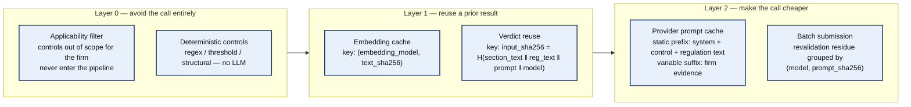

- **Prompt ordering is a cost decision, not a style one.** The static prefix (system instructions, control definition, regulation text) must precede the variable suffix (firm evidence chunks) so the provider's prefix cache hits across every firm evaluated against the same control. Reversing the order silently multiplies cost by the number of firms.
- **`input_sha256` is the single reuse primitive.** It composes every input that could change the answer. If it matches and no `invalidates` flag is set, the prior verdict is carried forward with `reused_from_evaluation_id` recorded — zero model cost, full auditability.
- **The verification pass is budgeted like the generation pass.** The groundedness judge is a second model call per verdict, and per-claim verification costs are the reason it sits behind two deterministic gates rather than in front of them. Cost per firm scales with *surviving* claims, not with claims generated.
- **Batch submission applies only to revalidation**, never to interactive uploads. A firm uploading a WSP is waiting for a result; a regulatory fan-out across 1,000 firms is not.

## 7.2 Provider gateway and EU residency

Single choke point. No module outside the gateway constructs a provider-specific request (ADR-007/ADR-009).

```python
if model_config.region not in EU_ALLOWED_REGIONS and request.contains_tenant_content:
    raise ProviderRegionViolation(model_config.id)
```

`contains_tenant_content` is set by the **caller's data classification**, not inferred from the payload. WSP text, evidence text, generated contextual prefixes derived from WSP text, and rationales quoting WSP text are all tenant content. Regulatory text alone is public and may route more freely — but any prompt that mixes the two is tenant content.

## 7.3 Human-in-the-loop boundaries

| Engine output | Written as | Confirmed by | Never |
|---|---|---|---|
| WSP→Requirement mapping | `ai_mapping.status = 'pending_review'` | Compliance Officer / CCO | Auto-confirmed at any confidence |
| Control verdict / finding | verdict `status = 'pending_review'` | Compliance Officer / CCO | Auto-closed, auto-waived |
| ChangeSet / impact report | draft in the regulatory review queue | Regulatory Analyst | Auto-published as a regulation update |
| New control version | `draft` | Regulatory Analyst | Auto-activated in the catalogue |
| Prompt / model configuration | `evaluating` | Eval gate ≥85% + AI Engineer | Promoted on a failed gate |

`NEEDS_HUMAN_REVIEW` is a terminal state of the AI stage, not an error condition. A high rate of it is a signal to tune retrieval or controls — not a defect to suppress by lowering thresholds.

## 7.4 Untrusted input handling

Both document streams are untrusted:

- **WSP PDFs** are customer-supplied. 3.11 performs a render-versus-extract comparison; divergence (white-on-white text, zero-size fonts, off-page content) flags an injection candidate, quarantines the document, and notifies rather than proceeding silently.
- **Regulatory XML/HTML** is fetched from official sources but still enters LLM prompts. It is inserted as delimited data with an explicit instruction that content inside the delimiters is never an instruction.
- **Structural defence, not prompt-level defence.** The verification gate (5.5–5.7) is what actually contains an injection that gets through: an injected instruction cannot produce a verdict whose `quoted_span` verifiably exists in a real chunk *and* whose claims are entailed by that span. Prompt hardening reduces the rate; the gate is what makes the failure non-silent.

## 7.5 Observability boundary

Ships to the monitoring stack: job id, job type, model and provider identifier, latency, token counts, confidence score, verdict distribution, cache hit rate, gate rejection rate, groundedness distribution.

Never ships: raw WSP text, raw prompt content, raw completion text. These live only in `ai_job.result_payload` and the evaluation store, under tenant access controls and EU residency. Metrics about content are exportable; content is not.

---

# 8. Control Flow — End-to-End Sequence

The DFDs above show data. This shows order, for the two journeys that matter.

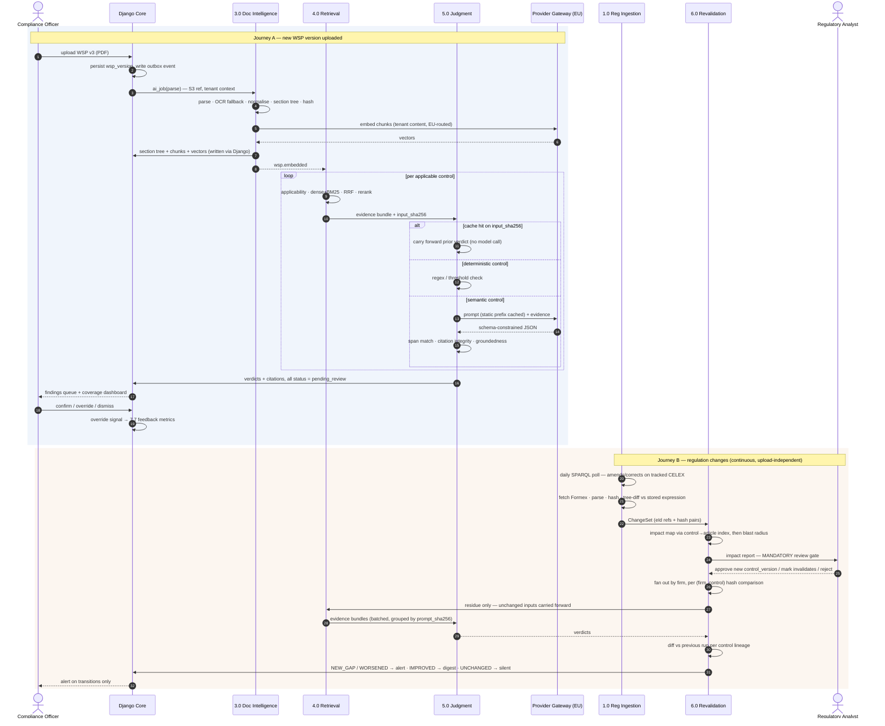

**The asymmetry between the two journeys is the product.** Journey A is what every compliance tool does. Journey B — the regulation moves, and only the affected firms and only the affected controls are re-judged, with unchanged inputs carried forward at zero model cost — is what makes "continuous" affordable.

---

# 9. Behavioural Models

## 9.1 AI job lifecycle

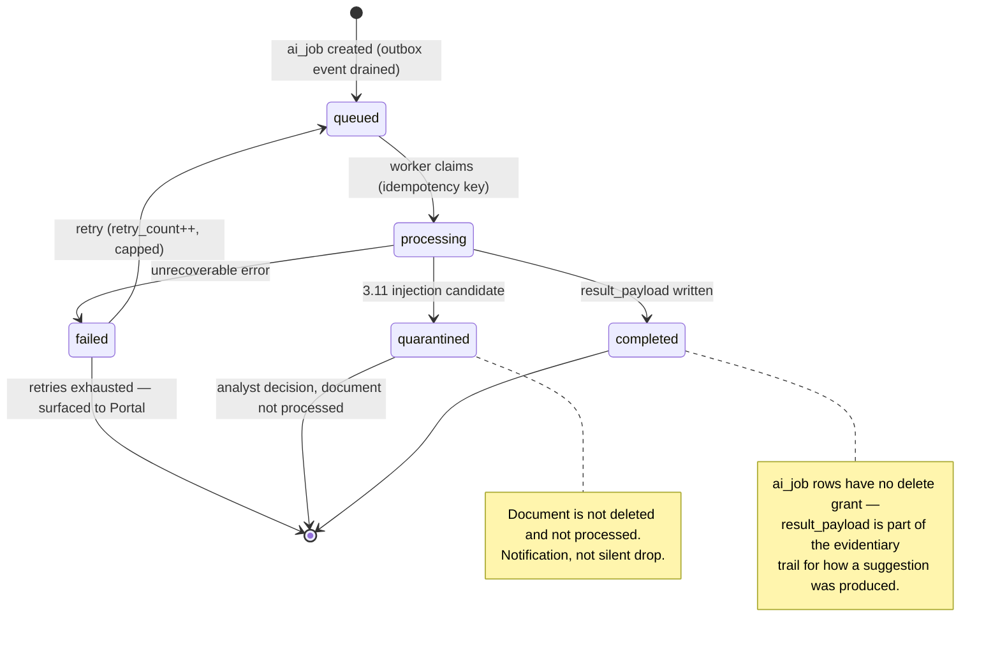

## 9.2 Finding lifecycle (engine's contribution highlighted)

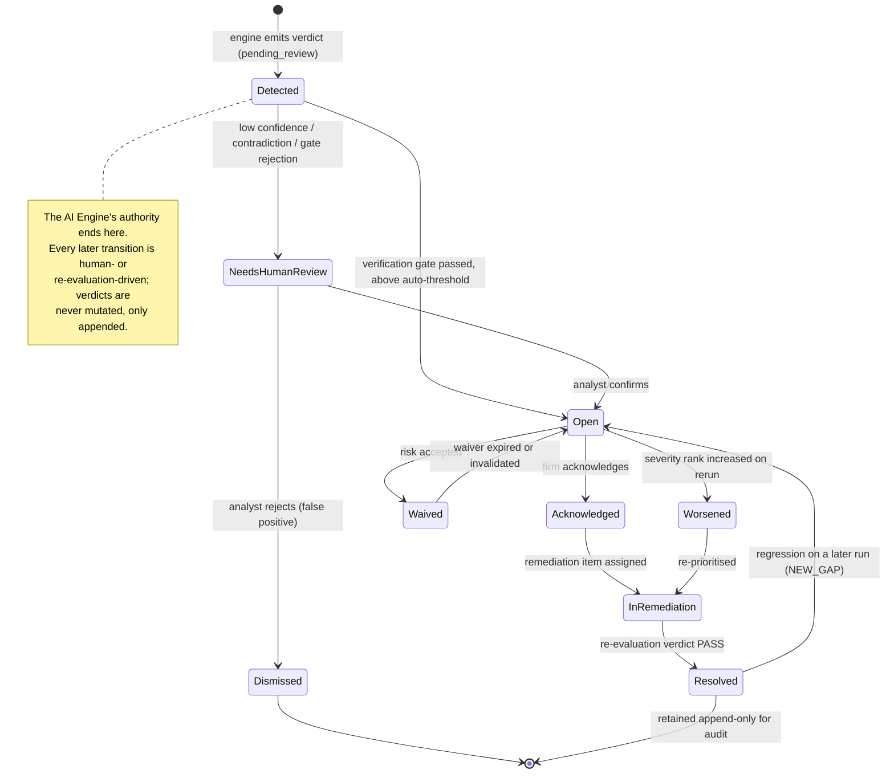

## 9.3 Control version lifecycle

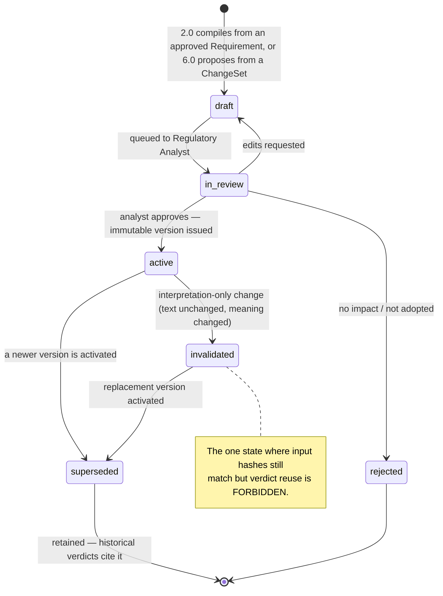

---

# 10. AI-Engine-Owned Data Model

Only the entities the engine reads or writes; the full schema is in Database Architecture v1.2.

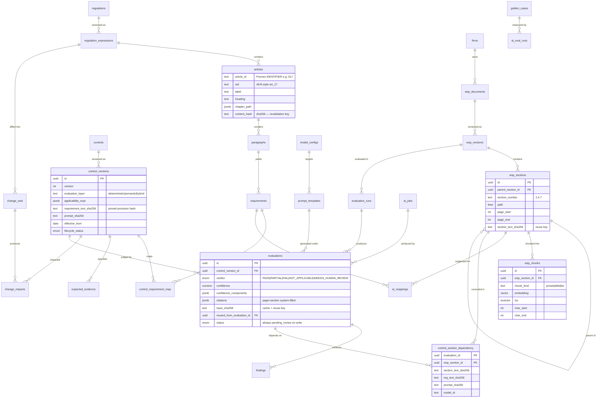

**The two load-bearing tables** are `control_section_dependency` (makes incremental revalidation possible at all) and `evaluations.input_sha256` (makes verdict reuse safe). Everything else is conventional.

---

# 11. Non-Functional Targets

| Concern | Target | Mechanism |
|---|---|---|
| Mapping accuracy | ≥ 85% on the golden set | ADR-025 promotion gate (7.5) |
| Groundedness | ≥ 0.8 auto; 0.7–0.8 flagged; < 0.7 blocked | Verification gate 5.7 |
| Citation validity | 100% — a citation that fails span match is never persisted as auto-decided | Deterministic checks 5.5/5.6 |
| WSP processing latency | Fully asynchronous; no user request blocks on it | Celery `ai` queue isolation |
| Revalidation cost | Only changed-input `(firm, control)` pairs incur model cost | D9 + `input_sha256` |
| Data residency | 100% of tenant-content inference in EU regions | Gateway hard check 7.2 |
| Auditability | Every verdict reproducible from archived inputs | D1a raw archive + provenance block |
| Content leakage | Zero raw content in observability tooling | Boundary 7.5 |

---

# 12. Reconciliations and Open Decisions

These are real disagreements between existing accepted documents, surfaced rather than silently resolved. Each needs a decision before implementation.

## 12.1 AI Service database access vs hybrid retrieval — **decision required**

*AI & Document Intelligence* §3 states the AI Service "has **no direct database access to any tenant schema**… it never queries PostgreSQL directly." But process 4.0's hybrid retrieval is fundamentally a set of SQL queries: a pgvector HNSW nearest-neighbour scan and a GIN-narrowed full-text scan, both filtered to a `wsp_version`. Round-tripping 50–150 candidate chunks per control through Django's internal API, for every control on every firm, is a significant volume of chatter on the hot path.

Three options:

| Option | Shape | Cost |
|---|---|---|
| **A — Retrieval endpoint in Django** (preserves the stated rule) | Django exposes `POST /internal/retrieval/candidates`; AI Service sends the query vector + filters, receives ranked candidates | Extra hop per control; embedding vector crosses the wire; retrieval logic splits across two services |
| **B — Read-only tenant-scoped connection** (amends the rule) | AI Service holds a role with `SELECT` only on chunk/section tables, tenant scoping enforced by search_path + row policy | Fastest; requires amending an accepted document and re-justifying ADR-004 isolation |
| **C — Django-side retrieval, AI-Service-side reranking** (split by nature of work) | Candidate generation (pure SQL) in Django; RRF fusion, cross-encoder rerank and parent expansion in the AI Service | Keeps the isolation rule intact and puts each stage where its dependencies already live |

**Recommendation: Option C.** Candidate generation is a database operation and belongs where the database access already is; reranking and fusion are model operations and belong in the AI Service. It honours the stated isolation rule without an artificial extra hop for work Django can do natively, and it keeps the expensive cross-encoder next to the GPU-bearing service. **This decision blocks implementation of 4.0 and should be recorded as a new ADR.**

## 12.2 Two decision vocabularies — **resolved in this document**

*AI & Document Intelligence* §5 describes mapping suggestions with a 0.4 confidence floor; the WSP research describes `PASS/PARTIAL/FAIL/NOT_APPLICABLE/NEEDS_HUMAN_REVIEW` verdicts. §1.2 above resolves these as **two distinct chained tasks**, both in scope, with distinct outputs and distinct gates. No change to either source document is required — but the Domain Model should adopt both terms explicitly so "confidence" is never ambiguous between the two.

## 12.3 BM25 implementation — **consistent, noted for scale**

Both documents agree: GIN `tsvector` narrows, true BM25 rescores over the narrowed set (Postgres's `ts_rank` lacks term-frequency saturation and length normalisation, both material for variable-length WSP sections). This adds no infrastructure and holds at Phase-1 scale. Revisit only if candidate-set sizes make in-process rescoring a latency problem — OpenSearch remains the documented extension point (ADR-008).

## 12.4 Regulatory scope beyond MiCA/DORA — **open**

The spike tracks two acts via a hardcoded `TRACKED` dict, correctly treated as configuration. The engine's design is act-agnostic: adding an RTS/ITS means adding a CELEX number and authoring controls. But **national regulators** referenced in ADR-026 mostly do not publish Formex, and the L3 layer (ESMA/EBA Q&As and guidelines) has no structured feed at all — content-hash monitoring of published pages is medium-low reliability, and the manual entry interface (1.7) is the real fallback. **Coverage commitments to customers must be scoped to what the automated channels actually cover.**

## 12.5 Open questions carried forward

| Question | Owner | Blocking? |
|---|---|---|
| Consolidation lag for MiCA/DORA amendments in practice (no published SLA) | AI Engineering — measure empirically over one quarter | No — provisional-mode diff covers the gap |
| EU-region provider and model selection per use case (embedding / completion / judge / rerank) | Architecture + Legal (DPA review) | Yes for production; architecture is provider-agnostic |
| Whether the groundedness judge may be the same model family as the generator | AI Engineering | No — different prompt is the minimum; different model is preferred |
| Golden dataset initial size and composition | Compliance SME + Sosinna's team | Yes for the 85% gate to mean anything |
| Whether scanned/image-only WSP pages must be supported in Phase 1 | Product | No — OCR path is designed either way |
| Expected-evidence sufficiency thresholds (what counts as an adequate procedure) | **REQUIRES LEGAL / COMPLIANCE INTERPRETATION** | Yes for control authoring |
| EU AI Act classification of this system and the resulting obligations | **REQUIRES LEGAL REVIEW** | Yes before go-live |
| Whether hybrid dense+BM25 fusion helps or hurts on EU regulation text specifically | AI Engineering — settle on the golden set, not by assumption | No, but it must be measured rather than assumed (§13) |
| How the schema-bound-citation recall penalty is compensated so an applicable article is never silently omitted | AI Engineering + Compliance SME | Yes — this is the failure mode the product cannot have |
| Golden-set size and inter-annotator agreement needed for a calibrated abstention threshold | Compliance SME + AI Engineering | Yes for the confidence policy to mean anything |

> **Standing caveat.** Applying FINRA-style Written Supervisory Procedures to EU MiCA/DORA obligations is interpretive mapping, not mechanical translation. Every control that bridges the two vocabularies **requires legal/compliance interpretation** and carries that flag through to the finding shown to the customer. The engine's job is to make the evidence and the reasoning inspectable — not to settle the interpretation.

---

# 13. Evidence Base — What Is Externally Supported, and What Is Not

A multi-source verification round was run against this design on 2026-09-07: six research angles, 28 primary sources fetched, 140 candidate claims extracted, 25 taken to adversarial verification (three independent votes each, two refutations to kill a claim). Eleven survived; fourteen were killed. This section records what that round supports, what it changed above, and — more importantly — what it did **not** establish.

## 13.1 What it confirms about this design

| Finding | Strength | Bearing on this document |
|---|---|---|
| Retrieving from the wrong source document is the dominant failure mode in naive legal RAG — above 95% on a pool of 362 near-identical NDAs with dense-only retrieval, no metadata filter, no reranker | Medium (2 of 3) | Motivates, rather than threatens, 4.3's hard filter to a single `wsp_version`. Document-scoped retrieval removes this class by construction; the number is a warning about unscoped retrieval, not a predicted rate for this engine |
| Chunk granularity is first-order: fixed-size chunks spanning several short articles coincide with context precision collapsing to 23.8–34.6, against 53.7–76.8 on a longer-article corpus | Medium (2 of 3) | Direct support for 3.7's rule that a chunk never crosses a section boundary, and for 1.4's article- and paragraph-level nodes on the regulation side. Notably, the cited authors chose fixed-size chunking while their own failure analysis argues against it |
| Prepending a short generated document-level summary to each chunk before embedding roughly halves wrong-document retrieval and improves text-level precision and recall | High (3 of 3) | Refines 3.8. The engine's contextual prefix is written at *section* level; the evidence supports adding a document-level fingerprint alongside it. Measured on contracts and privacy policies, not legislation |
| Binding every claim to a rule identifier inside a strict JSON schema raises citation F1 from 40.2 to 47.0, replicated across two model scales and two regulatory corpora | High (3 of 3) | Supports 5.3's schema-constrained decoding — with a caveat carried into §13.3 |
| Hallucination tracks inversely with context utilization; weaker retrieval coincides with more hallucination | High (3 of 3) | Retrieval quality is itself a hallucination control, which is the argument for 4.6's cross-encoder rerank earning its cost |
| Reliability in LLM adjudication comes from calibrated abstention, not a stronger judge: judging everything reached 77.8% human agreement and hit an 80% target in 13.9% of runs, while selective evaluation reached 80.2–80.4% agreement at 77.6–78.2% coverage | High (3 of 3) | The strongest external support for `NEEDS_HUMAN_REVIEW` as a first-class terminal state (§5.4, §7.3). Abstaining on roughly a fifth of cases is what buys the reliability |
| On the Claude platform, citations and structured outputs are mutually exclusive — requesting both returns HTTP 400 | High (3 of 3) | Confirms 5.4's separation: provenance is filled system-side from stored chunk metadata rather than requested from the provider's citation feature, so this incompatibility never becomes load-bearing |
| Citation granularity is fixed by document type — a PDF resolves only to a page range, with no section identifier | High (3 of 3) | Independent confirmation that a 150–200pp manual must be pre-chunked into addressable blocks (3.5–3.7) before any provenance claim is possible at section level |

## 13.2 What it changed

Three findings changed the design rather than endorsing it, and are already applied above:

1. **Constrained decoding does not guarantee schema compliance** (§5.4). Roughly 91–96% schema compliance against ~98% raw JSON validity means a schema-invalid verdict is routine at volume. 5.3 now carries an explicit regenerate-once-then-escalate path instead of assuming valid output.
2. **The model's self-reported confidence is not trustworthy** (§5.4, §6.3). Verbalized and predictive confidence are badly miscalibrated (ECE ≈ 0.22, AUROC as low as 0.55) where an agreement-based estimator roughly halves calibration error. The composite confidence is now explicitly system-measured, and any number the model writes about its own certainty is diagnostic only.
3. **Per-claim verification is a first-order cost** (§7.1). Measured per-claim verification costs span roughly $0.06 to over $1.00 depending on model. This is why 5.5 and 5.6 are deterministic and run on everything while 5.7's judge runs only on what survives them.

## 13.3 The one finding that cuts against the design

Schema-bound citation raises citation **precision** and F1 but **lowers citation recall** — 51.1 without the schema against 46.5 with it. The paper's own authors concede the schema "sacrifices recall compared to the eager-citing behaviour" of unconstrained generation.

For this product that is the wrong direction. A missed applicable article is the failure mode the engine exists to prevent, and it is worse than a spurious one. Three mitigations are already structural, and the fourth is an open question in §12.5:

- **Task M runs independently of Task E** (§1.2). Coverage mapping does not depend on the verdict pass, so an article can be surfaced as uncovered even when no verdict cites it.
- **Applicability drives the candidate set** (4.1). The control set is enumerated from the catalogue, not proposed by the model, so a control cannot be omitted by a generation choice.
- **Absence of evidence is an explicit verdict** (4.8). Falling below the relevance floor produces a candidate FAIL, not silence.
- Whether these are sufficient is unresolved and belongs on the eval harness, not in prose.

## 13.4 What the round did not establish

Three of the five research areas returned **no surviving evidence at all**. This is a gap in the evidence, not a negative result, and nothing in this document's treatment of these areas should be read as externally supported:

| Area | Status |
|---|---|
| **EU AI Act classification and obligations** for a compliance-assistance system — high-risk under Annex III, limited-risk with transparency duties, or out of scope — plus the consequent human-oversight, logging, record-keeping and technical-documentation duties | Zero claims survived, in either direction. Must be redone against primary sources: Regulation (EU) 2024/1689, ESMA and EBA guidance, EDPB opinions. Remains **REQUIRES LEGAL REVIEW** |
| **GDPR and data residency** for firm policy manuals processed by a hosted model | No verified evidence. §7.2's provider gateway stands on the project's own NFR-03 commitment, not on external authority |
| **Golden-dataset and evaluation practice** — dataset size, inter-annotator agreement targets, regression-testing discipline | Touched only obliquely. The 85% gate in §7.5 (ADR-025) is a project commitment; no external benchmark validates the threshold or the dataset design behind it |
| **Caching, batch APIs and incremental revalidation mechanics** | No caching or revalidation architecture was verified. §7.1 and DFD 6.0 rest on first principles and the hash-reuse argument, not on measured practice |
| **Hybrid dense+BM25 fusion for regulation text** | Claims in *both* directions were refuted. One paper shows BM25 lowering wrong-document retrieval while simultaneously lowering text-level precision and recall. The engine commits to hybrid retrieval (4.3–4.5); that commitment must be settled empirically on MiCA and DORA article text |

## 13.5 Standing caveats on this evidence

- **No claim was measured on this domain.** Not one surviving finding was tested on MiCA, DORA, EUR-Lex Formex XML, or FINRA WSP manuals. The evidence base is English contracts and NDAs, GDPR in English, the Luxembourg Civil Code in French, Korean R&D funding regulation, a HIPAA-derived set, and pairwise preference judging. Every number above is directional, never a predicted operating point for this engine.
- **Source quality is uneven.** Strongest: two provider primary docs verified live, one ICLR Oral, one EMNLP main-conference paper, two peer-reviewed workshop and Findings papers. Weakest: an unreviewed preprint carrying two of the retrieval and hallucination findings, built on a synthetic benchmark of 317 question–answer pairs from two documents with single-expert validation and therefore no computable inter-annotator agreement.
- **Vendor API facts are the most perishable items here** — the citations and structured-output incompatibility, schema limitations and cache-invalidation semantics were true on 2026-09-07. Re-verify before any of them becomes load-bearing.
- **Fourteen attractive claims were refuted** and should not be reintroduced without fresh verification, notably: that a 770M-parameter checker matches a frontier model at ~400× lower cost; that judge cascading cuts API cost by 78–87%; that a dedicated NLI verifier is the component that supplies groundedness; that the provider's citation feature guarantees valid spans; and that purpose-built legal RAG tools still hallucinate on more than 17% of queries.

# 14. Traceability

| Requirement / ADR | Where satisfied |
|---|---|
| FR-30 — OCR of scanned WSPs | DFD 3.0, process 3.3 |
| FR-31 — AI suggestions are a starting point only | §7.3; `pending_review` invariant in the §6.3 contract |
| FR-32 — two-person sign-off | Out of engine scope — Django dual-control service consumes engine output |
| FR-34 — gap analysis | §1.2 Task M; set difference over confirmed mappings, no LLM |
| NFR-03 — EU data residency | §7.2 provider gateway hard check |
| NFR-04 — tamper-proof audit | Append-only D6; no delete grant on D5; raw archive D1a |
| ADR-011 — automatic detection → human review → manual publication | DFD 6.0, gate 6.4 |
| ADR-025 — AI evaluation harness, 85% gate | DFD 7.0, gate 7.5 |
| ADR-026 — RSS/official APIs only, no HTML scraping | DFD 1.0; CELLAR REST + SPARQL verified in §2; manual intake 1.7 as fallback |
| ADR-007/009 — provider abstraction | §7.2 single choke point |
| TAB §10.1 — AI never decides | §7.3 boundary table; §9.2 note |

---

# 15. Version History

| Version | Date | Notes |
|---|---|---|
| 1.1 | 2026-09-07 | Added §13 Evidence Base from a 28-source adversarial verification round (11 claims confirmed, 14 refuted). Applied three design changes it forced: an explicit schema-invalid path in 5.3, exclusion of model-self-reported confidence from the 5.8 composite, and per-claim verification as a budgeted cost in §7.1. Recorded the schema-bound-citation recall penalty as the one finding that cuts against the design, and recorded that EU AI Act, GDPR, golden-dataset and caching practice returned no surviving external evidence. |
| 1.0 | 2026-09-07 | Initial AI Engine architecture. Level 0/1/2 DFD decomposition (7 processes, 10 data stores), regulatory data contract pinned against the verified `fetch_regulation.py` spike run (DORA 64 articles, MiCA 149 articles + 6 annexes), Task M / Task E separation, three-layer evaluation with hash-keyed reuse, anti-hallucination verification gate, change-impact and incremental revalidation design, governance and eval-harness flow, behavioural state models, engine-owned data model, and §12 reconciliations against AI & Document Intelligence v1.1 — including the unresolved AI-Service database-access decision (12.1). |
